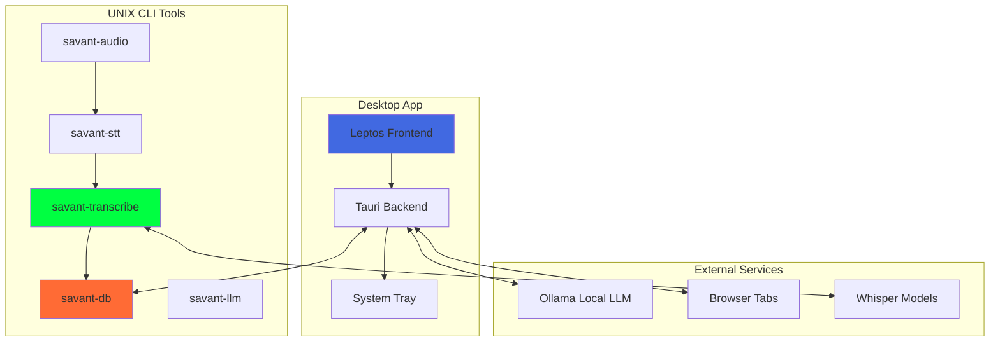
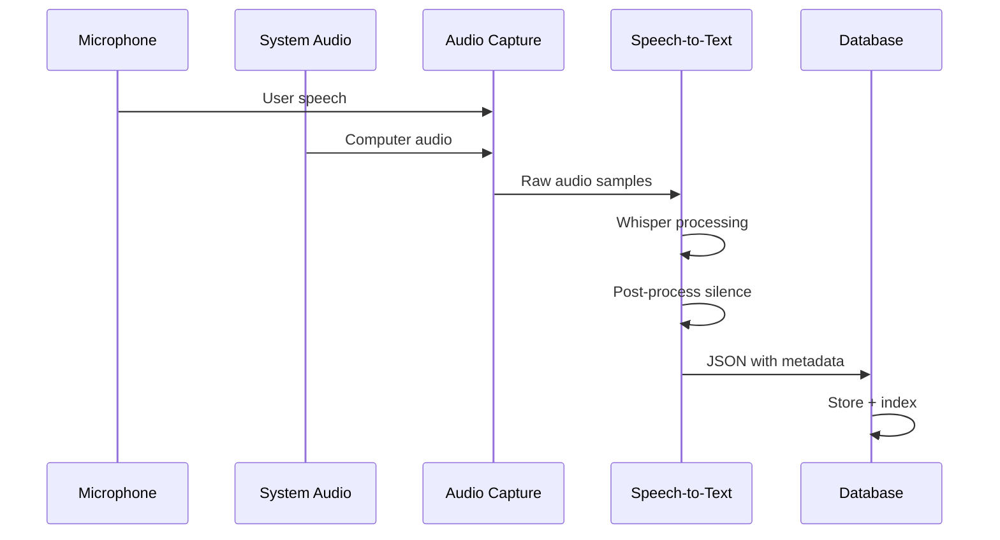

# Savant AI

An invisible, seamless AI assistant with real-time system audio transcription, smart long-term memory, standard chat capabilities, [ADD REST OF FEATURES HERE], and [WIP] browser monitoring.

*Only works on MacOS as of now*

## **TODO:**
- Refine structure / shape of (.md file) audio transcript output
- Determine behaviour and implement data pipeline from audio transcripts to smart database
- Figure out how to replicate app functionality on non MacOS systems, i.e. Windows & Linux
- Figure out how to containerize application and distribute; i.e. automate release cycle
- Implement more flexible / robust chatbot API solution; allow for use on machines that can t run Ollama models locally; allow for use of different models
- Implement MCP server(s) for chatbot to interact with smart database (and other outside tools)
- Fix non-functional browser monitor module and repair / update the GUI 

## Core features
- Audio Transcription: Real-time speech-to-text pipeline monitoring all audio I/O with smart database for long-term memory
- Chat Assistant: Local Ollama integration with conversation memory  
- [WIP] Browser Monitoring: Accessibility API-based content detection
- Invisibility: All operation should be hidden from external screen capture, screenshots, etc.

## Architecture

### Uses a set of self-contained, multi-purpose modules connected by data pipes (usually in the form of text streams) which can each also be used and standalone CLI apps



## Audio Pipeline



## i think this is the quickest way to start rn

```bash
# Install dependencies
brew install ollama
ollama pull devstral && ollama serve

# Clone and run
git clone <repo>
cd savant-ai
cargo tauri dev

# CLI tools
cargo run --package savant-transcribe -- --language en --duration 10
cargo run --package savant-db -- list
```

## Project Structure

```
savant-ai/
├── src/                    # Leptos frontend (WASM)
├── src-tauri/              # Tauri desktop backend
├── crates/
│   ├── savant-transcribe/  # Audio → JSON transcription
│   ├── savant-db/          # Database management
│   ├── savant-llm/         # LLM inference CLI
│   └── savant-{audio,stt,core}/  # Supporting libraries
└── docs/                   # Detailed documentation
```

## Configuration

Settings in `~/.config/savant-ai/config.toml`:

```toml
[ai_providers]
default_provider = "ollama"

[transcription]
default_language = "en"
auto_speaker_detection = true
```

## Documentation

- **[Architecture & Setup](docs/architecture.md)** - Detailed system design
- **[CLI Tools Guide](docs/cli-tools.md)** - UNIX tool usage patterns  
- **[Audio Transcription](docs/audio-transcription.md)** - Recording and processing
- **[Database System](docs/database.md)** - Storage and querying
- **[Deprecations](docs/deprecations.md)** - Cleanup and migration guide

## Status

**✅ Working**: Audio transcription, chat assistant, browser monitoring, CLI tools  
**🔄 In Progress**: Database integration, frontend optimization  
**📋 Planned**: Voice profiles, real-time streaming, advanced analytics
