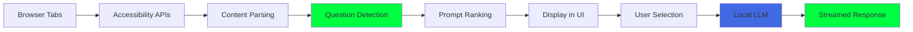
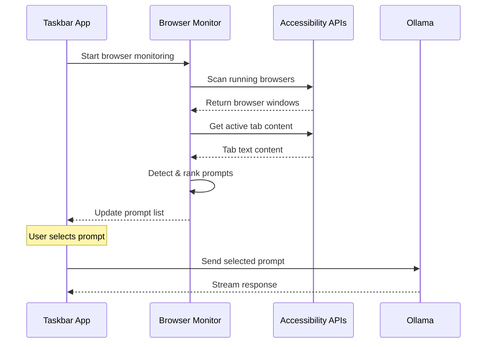

# Savant AI - Intelligent Assistant with Browser Monitoring

A stealth AI assistant that provides intelligent chat capabilities and browser monitoring to detect questions in web content and provide instant answers.

## **Core Features**

### **🕶️ Stealth Operation**
- Hidden from screenshots and screen recordings  
- System tray background operation
- macOS-native window transparency and invisibility
- No visible UI during normal operation

### **🧠 Intelligent Chat Assistant**
- Local LLM integration via Ollama
- Perfect conversation memory with persistent chat history
- Real-time response streaming
- Context-aware conversation management

### **🌐 Browser Content Monitoring**
- Detects running Chrome/Chromium browsers using Accessibility APIs
- Parses tab content to identify potential prompts and questions
- Ranks prompts by relevance and active tab context
- Seamless integration with chat assistant for answering detected questions

### **🤖 Multi-Provider AI Support**
- **Ollama**: Local inference (primary provider)
- **OpenAI**: GPT integration
- **DeepSeek**: Cost-effective cloud inference  
- **Anthropic**: Claude models

## **How It Works**



## **Browser Monitoring Architecture**



## **Global Hotkeys**

| Shortcut | Function |
|----------|----------|
| `Cmd+Shift+A` | Toggle AI overlay scanning |
| `Cmd+Shift+S` | Trigger immediate screenshot analysis |
| `Cmd+Shift+D` | Show/hide configuration dashboard |

## **Quick Start**

### **Prerequisites**
```bash
# Install Rust and Node.js
curl --proto '=https' --tlsv1.2 -sSf https://sh.rustup.rs | sh
npm install -g trunk

# Install local AI with Ollama
brew install ollama
ollama pull devstral  # or your preferred model
ollama serve  # Start Ollama service
```

### **Development**
```bash
# Clone and run
git clone <repository-url>
cd savant-ai

# Start development server (frontend + backend)
cargo tauri dev

# Frontend-only development  
trunk serve  # Opens at localhost:1420
```

### **Building**
```bash
# Debug build for testing
cargo tauri build --debug

# Release build for distribution
cargo tauri build --release
```

## **Configuration**

Settings stored in `~/.config/savant-ai/config.toml`:

```toml
[ai_providers]
default_provider = "ollama"
ollama_endpoint = "http://localhost:11434"
openai_api_key = ""
deepseek_api_key = ""

[stealth_settings]
stealth_mode_enabled = true
window_transparency = 0.9
always_on_top = true

[hotkeys]
toggle_overlay = "CommandOrControl+Shift+A"
screenshot_analyze = "CommandOrControl+Shift+S" 
show_dashboard = "CommandOrControl+Shift+D"
```

## **Technical Architecture**

### **Frontend (Leptos 0.7 WASM)**
```
src/
├── taskbar_app.rs           # Main minimalistic sidebar UI
├── components/
│   └── minimal_chat.rs      # Chat interface with browser toggle
└── utils/                   # Frontend utilities
```

### **Backend (Tauri 2.0 Rust)**
```
src-tauri/src/commands/
├── llm.rs                   # Multi-provider AI integration
├── chat_history.rs          # Persistent conversation storage
├── browser.rs               # Browser monitoring via Accessibility APIs
├── system.rs                # Stealth window management
├── hotkey.rs                # Global keyboard shortcuts
└── config.rs                # Configuration management
```

### **Key Components**

#### **Browser Monitoring** (`browser.rs`)
```rust
#[tauri::command]
pub async fn start_browser_monitoring(app: AppHandle) -> Result<(), String> {
    // Use macOS Accessibility APIs to scan browser windows
    let windows = scan_browser_windows().await?;
    
    // Detect prompts in active tab content
    let prompts = detect_prompts_in_content(&content).await?;
    
    // Emit to frontend for user selection
    let _ = app.emit("browser_state_update", &browser_state);
    Ok(())
}
```

#### **Chat History System** (`chat_history.rs`)
```rust
#[tauri::command]
pub async fn save_chat_history(messages: Vec<ChatMessage>) -> Result<(), String> {
    let history_path = get_chat_history_path()?;
    let json = serde_json::to_string_pretty(&messages)?;
    fs::write(&history_path, json)?;
    Ok(())
}
```

#### **Stealth System** (`system.rs`)
```rust
#[tauri::command]
pub async fn enable_stealth_mode(_window: Window) -> Result<(), String> {
    #[cfg(target_os = "macos")]
    {
        // Hide window from screenshots using setSharingType: 0
        // NSWindowSharingNone prevents screen capture
    }
    Ok(())
}
```

## **Current Status** ✅

### **Fully Implemented**
- ✅ **Core Architecture**: Tauri 2.0 + Leptos 0.7 foundation
- ✅ **Chat Assistant**: Perfect conversation memory with Ollama integration
- ✅ **Browser Monitoring**: Accessibility API-based content detection
- ✅ **Stealth Features**: Screenshot invisibility and system tray operation
- ✅ **Minimalistic UI**: Clean sidebar interface with browser toggle

### **Browser Monitoring Features**
- ✅ **Cross-browser Support**: Detects Chrome, Chromium, Edge, Arc
- ✅ **Content Parsing**: Extracts text from active browser tabs
- ✅ **Question Detection**: Identifies potential prompts using pattern matching
- ✅ **Real-time Updates**: Monitors tab switching and content changes
- ✅ **Integration**: Seamless handoff from browser detection to chat assistant

### **Next Steps** 🔄
- [ ] **Permission Handling**: Improve macOS Accessibility permission detection
- [ ] **Performance Optimization**: Optimize browser content scanning frequency
- [ ] **Enhanced Detection**: Improve prompt detection accuracy and relevance scoring