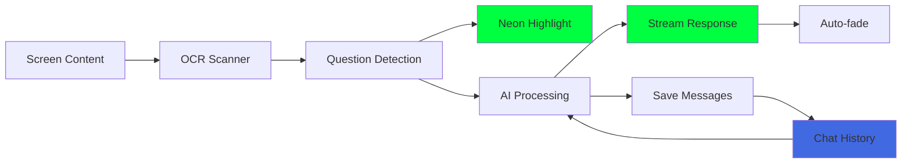
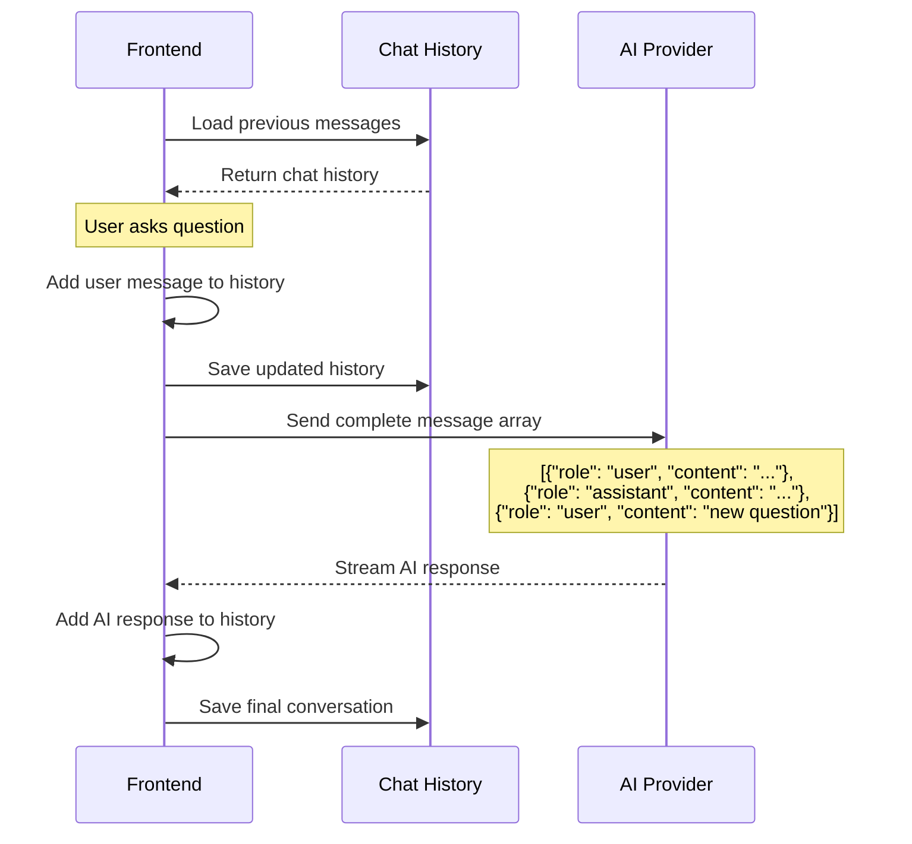

# Savant AI - Intelligent Screen Assistant

A completely invisible AI assistant that detects questions on your screen and provides instant answers through elegant neon overlays. Features perfect conversation memory, multi-provider AI support, and stealth operation.

## **Core Features**

### **🕶️ Complete Invisibility**
- No visible UI during normal operation
- Hidden from screenshots and screen recordings
- Click-through transparent overlays
- System tray background operation

### **🧠 Intelligent Question Detection**
- Real-time OCR screen scanning
- Smart pattern recognition for question identification
- Precise bounding box highlighting with neon green borders
- Continuous monitoring with minimal performance impact

### **💬 Perfect Conversation Memory**
- **NEW**: Structured message architecture for persistent chat history
- Full conversation context sent to LLM with every request
- Automatic chat history persistence across app restarts
- Clear history button for user control

### **🤖 Multi-Provider AI Support**
- **Ollama**: Local inference (privacy-focused)
- **OpenAI**: GPT-3.5/4 integration
- **DeepSeek**: Cost-effective cloud inference
- **Anthropic**: Claude models with structured responses

### **⚡ Real-time Response Streaming**
- Live AI text appearing character by character
- Neon green responses positioned below detected questions
- Auto-fade after completion
- Context-aware truncation for large conversations

## **How It Works**



## **Conversation Memory Architecture**

The app now uses a **structured message system** for perfect conversation memory:



### **Key Improvements**
- **Structured Messages**: Eliminates string parsing errors that caused memory loss
- **Immediate Persistence**: Every message saves instantly to `~/.config/savant-ai/chat_history.json`
- **Context Window Management**: Smart truncation preserves recent conversation context
- **Single Event Handling**: Prevents duplicate responses from multiple listeners

## **Global Hotkeys**

| Shortcut | Function |
|----------|----------|
| `Cmd+Shift+A` | Toggle AI overlay scanning |
| `Cmd+Shift+S` | Trigger immediate screenshot analysis |
| `Cmd+Shift+D` | Show/hide configuration dashboard |

## **Quick Start**

### **Prerequisites**
```bash
# Install Rust and Node.js
curl --proto '=https' --tlsv1.2 -sSf https://sh.rustup.rs | sh
npm install -g trunk

# macOS: Install Tesseract OCR
brew install tesseract

# Optional: Setup local AI with Ollama
brew install ollama
ollama pull devstral  # or your preferred model
```

### **Development**
```bash
# Clone and run
git clone <repository-url>
cd savant-ai

# Start development server (frontend + backend)
cargo tauri dev

# Frontend-only development
trunk serve  # Opens dashboard at localhost:1420
```

### **Building**
```bash
# Debug build for testing
cargo tauri build --debug

# Release build for distribution
cargo tauri build --release
# Creates: target/release/bundle/macos/savant-ai.app
```

## **Configuration**

The app stores settings in `~/.config/savant-ai/config.toml`:

```toml
[ai_providers]
default_provider = "ollama"
ollama_endpoint = "http://localhost:11434"
openai_api_key = ""
deepseek_api_key = ""
anthropic_api_key = ""

[stealth_settings]
stealth_mode_enabled = true
window_transparency = 0.9
always_on_top = true

[detection_settings]
ocr_scan_interval_ms = 500
question_confidence_threshold = 0.7

[hotkeys]
toggle_overlay = "CommandOrControl+Shift+A"
screenshot_analyze = "CommandOrControl+Shift+S"
show_dashboard = "CommandOrControl+Shift+D"
```

## **Technical Architecture**

### **Frontend (Leptos 0.7 WASM)**
```
src/
├── app.rs                    # Main application router
├── components/
│   ├── minimal_chat.rs       # Chat interface with memory
│   ├── dashboard.rs          # Configuration panel
│   └── overlay.rs            # Invisible question detection
└── utils/                    # Frontend utilities
```

### **Backend (Tauri 2.0 Rust)**
```
src-tauri/src/commands/
├── llm.rs                    # Multi-provider AI integration
├── chat_history.rs           # Persistent conversation storage
├── ocr.rs                    # Tesseract OCR processing
├── system.rs                 # Stealth window management
└── hotkey.rs                 # Global keyboard shortcuts
```

### **Key Components**

#### **Chat History System** (`chat_history.rs`)
```rust
#[tauri::command]
pub async fn save_chat_history(messages: Vec<ChatMessage>) -> Result<(), String> {
    let history_path = get_chat_history_path()?;
    let json = serde_json::to_string_pretty(&messages)?;
    fs::write(&history_path, json)?;
    Ok(())
}

#[tauri::command]  
pub async fn load_chat_history() -> Result<Vec<ChatMessage>, String> {
    let history_path = get_chat_history_path()?;
    if !history_path.exists() {
        return Ok(Vec::new());
    }
    let contents = fs::read_to_string(&history_path)?;
    serde_json::from_str(&contents)
}
```

#### **Structured AI Conversation** (`llm.rs`)
```rust
#[tauri::command]
pub async fn query_ollama_chat_streaming(
    app: AppHandle,
    model: String,
    prompt: String,
    messages: Vec<ChatMessage>  // Full conversation history
) -> Result<(), String> {
    // Convert to Ollama format
    let ollama_messages: Vec<OllamaChatMessage> = messages
        .into_iter()
        .map(|msg| OllamaChatMessage {
            role: if msg.is_user { "user" } else { "assistant" },
            content: msg.content,
        })
        .collect();
    
    // Send to Ollama's /api/chat endpoint with full context
    let request = OllamaChatRequest {
        model,
        messages: ollama_messages,
        stream: true,
    };
    
    // Stream response back to frontend
    stream_ollama_response(app, request).await
}
```

## **Current Status** ✅

### **Fully Implemented**
- ✅ **Core Architecture**: Tauri 2.0 + Leptos 0.7 foundation
- ✅ **Chat Memory**: Perfect conversation persistence with structured messages
- ✅ **Multi-Provider AI**: Ollama, OpenAI, DeepSeek, Anthropic support
- ✅ **Stealth System**: Invisible overlays with screenshot protection
- ✅ **Question Detection**: OCR-based text scanning with smart filtering
- ✅ **Global Hotkeys**: Cross-platform keyboard shortcuts
- ✅ **Real-time Streaming**: Live AI response rendering
- ✅ **Configuration**: Persistent TOML settings with reactive UI

### **Development Roadmap** 🔄

#### **Phase 2: Enhanced Detection**
- [ ] **Browser Integration**: Chrome DevTools Protocol for direct DOM access
- [ ] **Performance Optimization**: Sub-100ms question detection
- [ ] **Multi-language Support**: Question detection in multiple languages

#### **Phase 3: Advanced Features**
- [ ] **Learning System**: Adapt to user preferences and patterns
- [ ] **Voice Integration**: Audio responses and voice queries
- [ ] **Collaborative Features**: Shared Q&A knowledge bases

## **Privacy & Security**

- **Local Processing**: OCR and question detection performed locally
- **No Data Collection**: No telemetry or usage tracking
- **API Isolation**: Only detected questions sent to AI providers, never full screen content
- **User Control**: Clear history button and configurable AI providers
- **Open Source**: Full transparency of data handling

## **Contributing**

```bash
# Run tests
cargo test --workspace

# Code quality
cargo check --workspace
cargo clippy --workspace

# Test specific features
cargo test -p savant-ai-lib
```

Built with ❤️ using Rust, Tauri, and Leptos for maximum performance and security.