# Savant AI - Intelligent Screen Assistant

## **System Architecture & Information Flow**

```mermaid
graph TB
    %% User Environment
    subgraph "User Environment"
        User[👤 User]
        Screen[🖥️ Screen Content]
        Browser[🌐 Chrome Browser]
        Apps[📱 Other Applications]
    end

    %% Detection Methods
    subgraph "Content Detection Layer"
        OCR[📷 OCR Scanner<br/>Screenshot → Text]
        CDP[🔗 Chrome DevTools<br/>DOM → Text]
        
        OCR -->|500ms| TextExtract[📝 Text Extraction]
        CDP -->|10ms| TextExtract
    end

    %% Core Processing
    subgraph "Savant AI Core"
        QDetect[🔍 Question Detector<br/>NLP Pattern Matching]
        AIRouter[🤖 AI Router<br/>Multi-Provider]
        Overlay[✨ Invisible Overlay<br/>Neon Green UI]
        
        TextExtract --> QDetect
        QDetect -->|Question Found| AIRouter
        QDetect -->|Visual Highlight| Overlay
    end

    %% AI Providers
    subgraph "AI Processing"
        Ollama[🏠 Ollama Local<br/>localhost:11434]
        OpenAI[☁️ OpenAI API<br/>GPT-3.5/4]
        DeepSeek[☁️ DeepSeek API<br/>DeepSeek Chat]
        Anthropic[☁️ Anthropic API<br/>Claude]
        
        AIRouter --> Ollama
        AIRouter --> OpenAI
        AIRouter --> DeepSeek
        AIRouter --> Anthropic
    end

    %% System Integration
    subgraph "System Integration"
        Hotkeys[⌨️ Global Hotkeys<br/>Cmd+Shift+A/S/D]
        SystemTray[📍 System Tray<br/>Background Control]
        Config[⚙️ Configuration<br/>TOML Settings]
        
        Hotkeys --> Overlay
        SystemTray --> Overlay
        Config --> AIRouter
    end

    %% Visual Output
    subgraph "Visual Response System"
        NeonBox[💚 Neon Green Box<br/>Question Highlight]
        StreamText[💬 Streaming Response<br/>Real-time AI Text]
        AutoFade[⏱️ Auto-fade<br/>3-5 Second Timer]
        
        Overlay --> NeonBox
        AIRouter -->|Streaming| StreamText
        StreamText --> AutoFade
    end

    %% Information Flow
    Screen -.->|Screenshot| OCR
    Browser -.->|DOM Content| CDP
    User -.->|Reads Questions| Screen
    User -.->|Uses Hotkeys| Hotkeys
    User -.->|Controls App| SystemTray
    
    NeonBox -.->|Highlights Question| Screen
    StreamText -.->|Shows Answer| Screen
    AutoFade -.->|Returns to Invisible| Screen

    %% Processing Paths
    classDef currentPath fill:#00ff41,stroke:#00aa2e,stroke-width:3px
    classDef futurePath fill:#4169e1,stroke:#1e40af,stroke-width:2px
    classDef userLayer fill:#f59e0b,stroke:#d97706,stroke-width:2px
    classDef systemLayer fill:#8b5cf6,stroke:#7c3aed,stroke-width:2px

    class OCR,QDetect,AIRouter,Overlay currentPath
    class CDP futurePath
    class User,Screen,Browser,Apps userLayer
    class Hotkeys,SystemTray,Config systemLayer
```



## **Project Overview**
Savant AI is a completely invisible AI assistant that operates as a background process, remaining hidden until questions are detected on screen. When a question is identified via OCR, it displays a thin neon green bounding box around the detected text, converts it to a prompt, and streams the AI response in real-time below the question in matching neon green text.

### **Current Implementation Status** ✅
- **Backend**: Fully implemented Tauri 2.0 with modular command system
- **Frontend**: Complete Leptos 0.7 WASM application with reactive UI
- **AI Integration**: Multi-provider LLM support (Ollama local + OpenAI/DeepSeek/Anthropic APIs)
- **OCR Pipeline**: Tesseract-based text detection with intelligent question identification
- **Stealth System**: OS-level window manipulation for screenshot invisibility
- **Global Hotkeys**: Cmd+Shift+A/S/D shortcuts with system tray integration
- **Configuration**: Persistent TOML-based settings with reactive dashboard

### **Invisible Operation Model**
1. **Complete Invisibility**: No visible UI elements during normal operation
2. **Question Detection**: Continuous OCR scanning identifies text questions on screen  
3. **Visual Highlighting**: Thin neon green rounded box appears around detected questions
4. **Real-time Response**: AI answer streams live in neon green text below the question
5. **Auto-dismiss**: Response fades after completion, returning to invisible state

### **Key Features Implemented**
- ✅ **Complete Stealth Mode**: Undetectable by screenshots, no persistent UI
- ✅ **Smart Question Detection**: OCR + NLP pattern matching for question identification  
- ✅ **Neon Green Visual System**: Minimal, elegant question highlighting and response display
- ✅ **Multi-provider AI**: Ollama local + OpenAI/DeepSeek/Anthropic cloud integration
- ✅ **Real-time Streaming**: Live AI response rendering as tokens arrive
- ✅ **Control Panel Access**: Hidden dashboard via global hotkey (Cmd+Shift+D)
- ✅ **System Tray Integration**: Background operation with invisible mode toggle

## **Architecture & Project Structure**

### **Current Implementation Structure**
```text
savant-ai/
├── src/                        # Leptos frontend (WASM)
│   ├── app.rs                  # ✅ Main application with overlay controls
│   ├── components/             # ✅ Reactive UI components
│   │   ├── dashboard.rs        # ✅ Configuration dashboard with live settings
│   │   ├── overlay.rs          # ✅ Question detection overlay with bubbles
│   │   └── simple_*.rs         # ✅ Simplified component variants
│   └── utils/                  # ✅ Frontend utilities
│       ├── llm.rs              # ✅ AI provider communication
│       ├── ocr.rs              # ✅ OCR result processing
│       └── shared_types.rs     # ✅ Type definitions
│
├── src-tauri/                  # Tauri 2.0 backend
│   ├── src/commands/           # ✅ Modular command system
│   │   ├── config.rs           # ✅ Persistent configuration management
│   │   ├── llm.rs              # ✅ Multi-provider AI integration
│   │   ├── ocr.rs              # ✅ Tesseract OCR processing
│   │   ├── system.rs           # ✅ Stealth window management
│   │   └── hotkey.rs           # ✅ Global keyboard shortcuts
│   ├── capabilities/           # ✅ Tauri security manifests
│   └── tauri.conf.json         # ✅ Window config with stealth settings
│
├── dist/                       # ✅ Trunk build output
├── public/                     # ✅ Static assets (SVG icons)
└── ~/.config/savant-ai/        # ✅ User configuration storage
    └── config.toml             # ✅ Persistent settings
## **Core Implementation Details**

### **A. Invisible Overlay System** (`src-tauri/src/commands/system.rs`)
The invisibility system creates completely transparent, click-through overlay windows that only become visible when questions are detected:

```rust
#[tauri::command]
pub async fn create_invisible_overlay() -> Result<(), String> {
    let overlay_window = WindowBuilder::new(
        app,
        "overlay",
        tauri::WindowUrl::App("/overlay".into())
    )
    .transparent(true)
    .decorations(false)
    .always_on_top(true)
    .skip_taskbar(true)
    .fullscreen(true)
    .resizable(false)
    .build()?;
    
    #[cfg(target_os = "macos")]
    {
        // Make completely invisible to screenshots
        let ns_window = overlay_window.ns_window()?;
        unsafe {
            let _: () = msg_send![ns_window, setSharingType: NSWindowSharingType::NSWindowSharingNone];
            let _: () = msg_send![ns_window, setIgnoresMouseEvents: true];
        }
    }
    Ok(())
}
```

**Invisible Operation Features:**
- **Fullscreen Transparent Overlay**: Covers entire screen with 100% transparency
- **Click-through**: Mouse events pass through to underlying applications
- **Screenshot Invisible**: Hidden from all screen capture methods
- **Question Highlighting**: Dynamic neon green boxes appear only around detected text
- **Auto-hide Responses**: AI answers fade out after completion

### **B. AI Pipeline** (`src-tauri/src/commands/llm.rs`)
Multi-provider AI system with intelligent fallback mechanisms:

```rust
#[tauri::command] 
pub async fn query_llm(
    provider: String,
    model: String, 
    prompt: String,
    config: LlmConfig
) -> Result<LlmResponse, String> {
    match provider.as_str() {
        "ollama" => query_ollama(&model, &prompt).await,
        "openai" => query_openai(&model, &prompt, &config.openai_api_key).await,
        "deepseek" => query_deepseek(&model, &prompt, &config.deepseek_api_key).await,
        "anthropic" => query_anthropic(&model, &prompt, &config.anthropic_api_key).await,
        _ => Err("Unsupported provider".to_string())
    }
}
```

**Provider Support:**
- **Ollama**: Local inference (localhost:11434)
- **OpenAI**: GPT-3.5/4 with API key authentication
- **DeepSeek**: Cost-effective cloud inference
- **Anthropic**: Claude models with structured responses

### **C. Smart Question Detection** (`src-tauri/src/commands/ocr.rs`)
Continuous screen scanning with intelligent question identification and precise bounding box detection:

```rust
#[derive(Serialize, Deserialize)]
pub struct DetectedQuestion {
    pub text: String,
    pub confidence: f32,
    pub bounding_box: BoundingBox,
    pub screen_position: ScreenPosition,
}

#[tauri::command]
pub async fn continuous_screen_scan() -> Result<Vec<DetectedQuestion>, String> {
    loop {
        let screenshot = take_screenshot().await?;
        let ocr_results = process_with_tesseract(&screenshot).await?;
        
        let questions = ocr_results.into_iter()
            .filter_map(|result| {
                if is_question(&result.text) && result.confidence > 0.7 {
                    Some(DetectedQuestion {
                        text: result.text,
                        confidence: result.confidence,
                        bounding_box: result.bbox,
                        screen_position: result.position,
                    })
                } else {
                    None
                }
            })
            .collect();
            
        if !questions.is_empty() {
            emit_question_detected(questions).await?;
        }
        
        tokio::time::sleep(Duration::from_millis(500)).await;
    }
}

fn is_question(text: &str) -> bool {
    let patterns = [
        r"^(what|how|why|when|where|who|which|can|could|would|should|is|are|do|does|did)\b",
        r"\?$",
        r"^(help|explain|show|tell|find|solve|calculate)\b",
        r"(how to|what is|why does|when will|where can)"
    ];
    patterns.iter().any(|pattern| regex::Regex::new(pattern).unwrap().is_match(&text.to_lowercase()))
}
```

**Question Detection Features:**
- **Continuous Scanning**: 500ms intervals for real-time detection
- **Precise Bounding Boxes**: Exact pixel coordinates for question highlighting
- **Confidence Scoring**: Filters out low-confidence false positives
- **Pattern Recognition**: Advanced regex matching for various question types

### **D. Global Hotkey System** (`src-tauri/src/commands/hotkey.rs`)
Cross-platform keyboard shortcuts with system integration:

```rust
static HOTKEY_MANAGER: Lazy<Mutex<Option<GlobalHotKeyManager>>> = Lazy::new(|| Mutex::new(None));

#[tauri::command]
pub async fn register_global_hotkeys(app: AppHandle) -> Result<(), String> {
    let hotkeys = vec![
        HotKey::new(Some(Modifiers::META | Modifiers::SHIFT), Code::KeyA), // Cmd+Shift+A
        HotKey::new(Some(Modifiers::META | Modifiers::SHIFT), Code::KeyS), // Cmd+Shift+S  
        HotKey::new(Some(Modifiers::META | Modifiers::SHIFT), Code::KeyD), // Cmd+Shift+D
    ];
    // Registration and event handling
}
```

**Hotkey Functions:**
- **Cmd+Shift+A**: Toggle AI overlay scanning
- **Cmd+Shift+S**: Trigger immediate screenshot analysis  
- **Cmd+Shift+D**: Show/focus dashboard window

### **E. Neon Green Visual System** (`src/components/overlay.rs`)
Dynamic visual elements that appear only when questions are detected:

```rust
#[component]
pub fn InvisibleOverlay() -> impl IntoView {
    let (detected_questions, set_detected_questions) = signal(Vec::<DetectedQuestion>::new());
    let (ai_responses, set_ai_responses) = signal(HashMap::<String, String>::new());
    
    // Listen for question detection events
    create_effect(move |_| {
        spawn_local(async move {
            listen_for_questions(set_detected_questions).await;
        });
    });

    view! {
        <div class="invisible-overlay">
            <For
                each=detected_questions
                key=|q| q.id.clone()
                children=move |question| {
                    view! {
                        <NeonQuestionBox 
                            question=question.clone()
                            on_ai_response=move |response| {
                                set_ai_responses.update(|responses| {
                                    responses.insert(question.id.clone(), response);
                                });
                            }
                        />
                    }
                }
            />
        </div>
    }
}

#[component]
fn NeonQuestionBox(
    question: DetectedQuestion,
    on_ai_response: impl Fn(String) + 'static
) -> impl IntoView {
    let (streaming_response, set_streaming_response) = signal(String::new());
    
    // Position box at exact question location
    let box_style = format!(
        "position: absolute; top: {}px; left: {}px; width: {}px; height: {}px;",
        question.bounding_box.y,
        question.bounding_box.x, 
        question.bounding_box.width,
        question.bounding_box.height
    );
    
    view! {
        <div 
            class="neon-question-box"
            style=box_style
        >
            // Thin neon green border around detected question
        </div>
        
        <div 
            class="neon-response-text"
            style=format!("top: {}px; left: {}px;", 
                question.bounding_box.y + question.bounding_box.height + 10,
                question.bounding_box.x
            )
        >
            {streaming_response}
        </div>
    }
}
```

**Neon Visual Features:**
- **Precise Question Boxing**: Thin neon green rounded rectangles around detected text
- **Real-time Response Streaming**: Live AI text appearing character by character
- **Auto-positioning**: Responses appear directly below question boxes  
- **Fade-out Animation**: Elements disappear after response completion
- **Minimal Visual Impact**: Only essential highlighting, no persistent UI
## **Development Workflow**

### **Getting Started**
```bash
# Clone and build the application
git clone <repository-url>
cd savant-ai
cargo tauri build --debug  # Creates .app bundle for testing

# Development with hot reload
cargo tauri dev

# Frontend-only development  
trunk serve  # localhost:1420 for dashboard
# Overlay accessible at localhost:1420/overlay
```

### **Browser Integration Setup**
```bash
# Enable Chrome remote debugging (required for browser integration)
# macOS
open -n -a "Google Chrome" --args --remote-debugging-port=9222 --user-data-dir=/tmp/chrome-debug

# Windows  
chrome.exe --remote-debugging-port=9222 --user-data-dir="%TEMP%\chrome-debug"

# Linux
google-chrome --remote-debugging-port=9222 --user-data-dir=/tmp/chrome-debug

# Verify connection
curl http://localhost:9222/json  # Should list open tabs
```

### **Testing & Quality**
```bash
# Run all tests
cargo test --workspace

# Code quality checks
cargo check --workspace
cargo clippy --workspace

# Test browser integration
cargo test test_chrome_cdp --features browser-integration
```

### **Build Outputs**
```bash
# Debug build (for development)
cargo tauri build --debug
# Output: target/debug/bundle/macos/savant-ai.app

# Release build (for distribution)
cargo tauri build --release  
# Output: target/release/bundle/macos/savant-ai.app
#         target/release/bundle/dmg/savant-ai_0.1.0_aarch64.dmg
```

## **Configuration Management**

### **Persistent Configuration** (`~/.config/savant-ai/config.toml`)
```toml
[ai_providers]
default_provider = "ollama"
ollama_endpoint = "http://localhost:11434"
openai_api_key = ""
deepseek_api_key = ""
anthropic_api_key = ""

[stealth_settings]  
stealth_mode_enabled = true
window_transparency = 0.9
always_on_top = true

[detection_settings]
# OCR-based detection (legacy)
ocr_scan_interval_ms = 1000
question_confidence_threshold = 0.7

# Browser-based detection (new)
browser_monitoring_enabled = true
chrome_debug_port = 9222
firefox_debug_port = 9223
safari_debug_port = 9224
content_scan_interval_ms = 100

[browser_integration]
auto_launch_chrome_debug = true
monitor_all_tabs = true
ignore_background_tabs = false
detect_in_iframes = true

[hotkeys]
toggle_overlay = "CommandOrControl+Shift+A"
screenshot_analyze = "CommandOrControl+Shift+S"  
show_dashboard = "CommandOrControl+Shift+D"
toggle_browser_mode = "CommandOrControl+Shift+B"
```

### **Tauri Configuration** (`src-tauri/tauri.conf.json`)
```json
{
  "productName": "Savant AI",
  "bundle": {
    "active": true,
    "macOS": {
      "minimumSystemVersion": "10.13",
      "LSUIElement": true
    }
  },
  "app": {
    "macOSPrivateApi": true,
    "withGlobalTauri": false
  }
}
```

## **Current Status & Next Steps**

### **✅ Current Implementation Status**

#### **Phase 1: Foundation Complete** ✅
1. **Core Architecture**: Tauri 2.0 + Leptos 0.7 foundation with dual-window system
2. **Build System**: Fully functional compilation and bundling (macOS .app + .dmg)
3. **Command Infrastructure**: 15+ Tauri commands for OCR, LLM, and system operations
4. **AI Integration**: Multi-provider framework (Ollama local + OpenAI/DeepSeek/Anthropic APIs)
5. **Stealth System**: OS-level window manipulation with screenshot invisibility
6. **Global Hotkeys**: Cross-platform keyboard shortcuts (Cmd+Shift+A/S/D)
7. **Configuration**: Persistent TOML-based settings with reactive dashboard
8. **Neon Visual System**: CSS framework for question highlighting and response display

#### **Current Functional State**
- **✅ Builds Successfully**: All compilation errors resolved
- **✅ Application Bundle**: Generates macOS .app and .dmg installers
- **✅ Invisible Overlay**: Transparent fullscreen window system implemented
- **✅ Backend Commands**: Complete command layer for all core operations
- **⚠️ Mock Data**: OCR and LLM integration using placeholder responses
- **⚠️ Frontend**: Simplified components, advanced reactive features pending

### **🔄 Development Roadmap**

#### **Phase 2: Enhanced Question Detection** (Current Priority)

##### **2A: Browser Integration Revolution** 🚀
**New Approach**: Direct browser content streaming via Chrome DevTools Protocol
- [ ] **Chrome DevTools Integration**: Hook into browser via CDP for real-time DOM access
- [ ] **HTML Content Streaming**: Stream webpage content directly without OCR
- [ ] **Cross-tab Monitoring**: Monitor all open browser tabs simultaneously
- [ ] **Question Detection in HTML**: Parse text content directly from DOM elements
- [ ] **Browser Extension**: Optional companion extension for enhanced integration
- [ ] **Multi-browser Support**: Extend to Firefox, Safari, Edge via their respective APIs

**Technical Implementation**:
```rust
// Chrome DevTools Protocol integration
struct ChromeCDPClient {
    websocket: WebSocket,
    tab_sessions: HashMap<String, TabSession>,
}

// Real-time DOM content streaming
#[tauri::command]
async fn start_browser_monitoring() -> Result<(), String> {
    let cdp = ChromeCDPClient::connect("ws://localhost:9222").await?;
    cdp.enable_runtime_events().await?;
    cdp.stream_dom_content(question_detector).await?;
}
```

**Advantages over OCR**:
- **⚡ Performance**: No image processing overhead
- **🎯 Precision**: Exact text coordinates and formatting
- **📄 Context**: Access to full page structure and metadata
- **🔍 Accuracy**: 100% text recognition vs OCR errors
- **⚙️ Efficiency**: Lower CPU usage, higher battery life

##### **2B: Advanced Question Processing**
- [ ] **Intelligent Question Classification**: Categorize questions by type and complexity
- [ ] **Context-aware Responses**: Use surrounding page content for better answers
- [ ] **Multi-language Support**: Detect and respond in detected language
- [ ] **Smart Caching**: Cache responses for repeated questions

#### **Phase 3: Production Features** (Next)
- [ ] **Real-time Frontend**: Complete reactive overlay with streaming responses
- [ ] **Performance Optimization**: Sub-100ms question detection and highlighting
- [ ] **Cross-platform Polish**: Windows/Linux browser integration
- [ ] **User Preferences**: Customizable response styles and filtering

#### **Phase 4: Advanced Intelligence** (Future)
- [ ] **Learning System**: Adapt to user preferences and question patterns
- [ ] **Proactive Assistance**: Suggest helpful information before questions are asked
- [ ] **Collaborative Features**: Share curated Q&A databases
- [ ] **Voice Integration**: Audio responses and voice-activated queries

## **Browser Integration Architecture**

### **Chrome DevTools Protocol (CDP) Integration**

#### **Connection Strategy**
```bash
# Launch Chrome with remote debugging enabled
chrome --remote-debugging-port=9222 --user-data-dir=/tmp/chrome-debug
```

#### **Real-time Content Monitoring**
```rust
// Browser content streaming architecture
#[derive(Debug)]
struct BrowserMonitor {
    cdp_client: ChromeCDPClient,
    active_tabs: HashMap<String, TabContent>,
    question_detector: QuestionDetector,
}

impl BrowserMonitor {
    async fn start_monitoring(&mut self) -> Result<()> {
        // Connect to all open tabs
        let tabs = self.cdp_client.list_tabs().await?;
        
        for tab in tabs {
            self.monitor_tab(&tab.id).await?;
        }
        
        // Listen for new tabs and content changes
        self.cdp_client.on_target_created(|target| {
            spawn(self.monitor_tab(target.id))
        }).await?;
    }
    
    async fn monitor_tab(&mut self, tab_id: &str) -> Result<()> {
        let session = self.cdp_client.attach_to_target(tab_id).await?;
        
        // Enable DOM events
        session.send_command("DOM.enable", None).await?;
        session.send_command("Runtime.enable", None).await?;
        
        // Stream content changes
        session.on_event("DOM.documentUpdated", move |_| {
            self.process_tab_content(tab_id).await
        }).await?;
    }
    
    async fn process_tab_content(&mut self, tab_id: &str) -> Result<()> {
        let dom = self.cdp_client.get_document(tab_id).await?;
        let text_content = extract_text_with_positions(&dom);
        
        let questions = self.question_detector.detect(&text_content).await?;
        if !questions.is_empty() {
            self.trigger_ai_responses(questions).await?;
        }
    }
}
```

#### **Multi-Browser Support Matrix**
| Browser | Protocol | Port | Status |
|---------|----------|------|---------|
| Chrome | Chrome DevTools | 9222 | ✅ Primary |
| Edge | Chrome DevTools | 9222 | ✅ Compatible |
| Firefox | Firefox Remote | 9223 | 🔄 Planned |
| Safari | Safari Remote | 9224 | 🔄 Future |

### **Enhanced Question Detection Pipeline**

#### **HTML-based Detection vs OCR**
```rust
// Old approach: Screenshot → OCR → Text → Questions
async fn ocr_detection() -> Vec<Question> {
    let screenshot = take_screenshot().await?;
    let text = tesseract_ocr(screenshot).await?;  // ~500ms
    let questions = parse_questions(text).await?;  // ~50ms
    questions
}

// New approach: Browser → DOM → Text → Questions  
async fn browser_detection() -> Vec<Question> {
    let dom_content = get_active_tab_content().await?;  // ~10ms
    let questions = parse_dom_questions(dom_content).await?;  // ~20ms
    questions
}
```

### **Key Technical Considerations**

#### **1. Browser Integration Requirements**
- **Chrome/Edge**: Remote debugging enabled (`--remote-debugging-port=9222`)
- **Firefox**: Developer tools remote debugging via `about:config`
- **Safari**: Web Inspector remote connections (macOS only)
- **Security**: Browser must trust local CDP connections

#### **2. Performance Targets (Browser Mode)**
- **Content Retrieval**: <10ms per tab update
- **Question Detection**: <20ms for HTML parsing
- **AI Response**: <2s for local, <5s for cloud
- **Memory Usage**: <50MB baseline, <200MB with multiple tabs

#### **3. Enhanced Invisibility Model**
- **Zero Visual Impact**: No browser extensions or visible modifications
- **Background Monitoring**: Continuous content streaming without user awareness
- **Precise Positioning**: Exact DOM element coordinates for neon highlighting
- **Smart Filtering**: Ignore dynamic content updates, focus on user-readable text

#### **4. Security & Privacy**
- **Local Processing**: All content analysis performed locally
- **No Data Storage**: Browser content streamed and processed in memory only
- **User Consent**: Clear opt-in for browser monitoring capabilities
- **API Isolation**: AI requests contain only detected questions, not full page content

#### **5. Cross-platform Compatibility**
- **macOS**: Full support for all browsers via native APIs
- **Windows**: Chrome/Edge via CDP, Firefox via remote protocol
- **Linux**: Chrome/Firefox support, Safari not available
