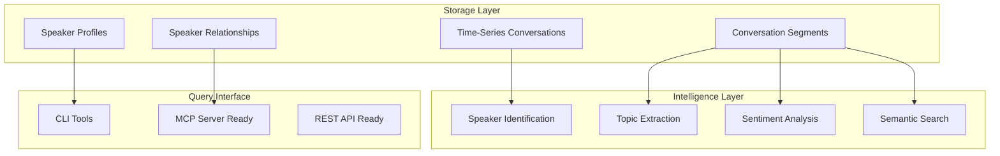

# Savant AI Documentation

Comprehensive documentation for the intelligent conversation storage and analysis system.

## Documentation Structure

### Core Systems
- **[Database System](database.md)** - Advanced SQLite storage with speaker identification and semantic search
- **[Smart Database Pipeline](smart-database-pipeline.md)** - Complete architecture for conversation intelligence
- **[Audio Transcription](audio-transcription.md)** - Real-time speech-to-text with speaker separation
- **[CLI Tools Guide](cli-tools.md)** - UNIX philosophy command-line tools
- **[Architecture Overview](architecture.md)** - System design and component relationships

### User Guides (`user-guides/`)
- **[System Audio Setup](user-guides/SYSTEM_AUDIO_SETUP.md)** - Complete audio capture setup with single-instance protection
- **[Getting Started](user-guides/GETTING_STARTED.md)** - Quick start guide for new users
- **[Audio Management](user-guides/AUDIO_MANAGEMENT.md)** - Managing audio captures and transcriptions

### Development Documentation (`development/`)
- **[UNIX Philosophy Demo](development/UNIX_PHILOSOPHY_DEMO.md)** - Composable CLI tool implementation
- **[UNIX Refactor Plan](development/UNIX_REFACTOR_PLAN.md)** - Planning document for modular architecture
- **[Cleanup Candidates](development/CLEANUP_CANDIDATES.md)** - Legacy code removal and optimization
- **[Deprecations](deprecations.md)** - Deprecated features and migration paths

## Quick Navigation

- **New to Savant AI?** Start with [Getting Started](user-guides/GETTING_STARTED.md)
- **Setting up audio?** See [System Audio Setup](user-guides/SYSTEM_AUDIO_SETUP.md)
- **Database queries?** Check [Database System](database.md)
- **CLI usage?** Review [CLI Tools Guide](cli-tools.md)
- **Architecture deep-dive?** Read [Smart Database Pipeline](smart-database-pipeline.md)

## Current System Capabilities

### Core Features
- **Speaker Identification**: Text-pattern and voice biometric framework
- **Conversation Analytics**: Automatic topic extraction, sentiment analysis
- **Semantic Search**: Full-text and similarity-based conversation search
- **Relationship Tracking**: Speaker interaction patterns and frequency analysis
- **Real-time Processing**: <5 second latency for speaker identification
- **UNIX Philosophy**: Composable CLI tools for complex workflows

### Database Architecture


## Common Workflows

### Audio Capture & Storage
```bash
# Continuous background capture with speaker identification
./sav start                           # Start daemon
./sav status                          # Check status
./sav logs                           # View live logs

# Manual recording with speaker attribution
savant-transcribe --speaker "john_doe" --duration 60 | \
savant-db store --title "Meeting Notes"
```

### Speaker Management
```bash
# List all speakers with interaction statistics
savant-db speaker list

# Find and merge duplicate speakers
savant-db speaker duplicates
savant-db speaker merge primary-id secondary-id

# Analyze specific speaker's conversation patterns
savant-db speaker show speaker-id
```

### Advanced Analytics
```bash
# Semantic search across all conversations
savant-db search "project deadline concerns" --limit 10

# Extract conversation insights
savant-db analyze conversation-id

# Generate relationship analytics
savant-db export-relationships --format json > network.json
```

### Data Pipeline Integration
```bash
# Real-time processing pipeline
./sav start  # → Audio capture → Transcription → Speaker ID → Database

# Batch analysis workflow
savant-db list --limit 50 | jq -r '.[].id' | while read conv_id; do
  savant-db topic extract "$conv_id"
  savant-db analyze "$conv_id"
done
```

## Data Management

### Storage Locations
- **Database**: `~/.config/savant-ai/transcripts.db` - SQLite with time-series optimization
- **Audio Captures**: `~/Documents/savant-ai/data/audio-captures/` - Processed transcriptions
- **Daemon Logs**: `~/Documents/savant-ai/data/daemon-logs/` - System operation logs

### Performance Optimizations
- **Time Partitioning**: Daily partitions for conversation queries
- **Speaker Indexing**: Fast lookup by person and relationship
- **Vector Search**: Prepared for semantic similarity (384-dim embeddings)
- **Full-Text Search**: SQLite FTS5 for content queries
- **Caching**: Multi-level caching for hot data and speaker embeddings

## Architecture Principles

### UNIX Philosophy Implementation
- **Single Purpose**: Each tool does one thing well (`savant-transcribe`, `savant-db`, `savant-llm`)
- **Composability**: Tools pipe together for complex workflows
- **JSON I/O**: Structured data exchange between components
- **Independence**: Each component testable and usable standalone

### Privacy-First Design
- **Local Processing**: All analysis happens on-device
- **Encrypted Storage**: Speaker data encrypted at rest
- **Consent Management**: Framework for multi-party recording consent
- **Data Minimization**: Only necessary data persisted with automatic cleanup

### Real-Time Intelligence
- **Streaming Pipeline**: Process audio as it arrives
- **Progressive Learning**: Speaker models improve over time
- **Context Awareness**: Calendar integration and location context
- **Relationship Analytics**: Track interaction patterns and communication frequency

## Current Implementation Status

### Completed
- **Database Schema**: Enhanced with speaker identification and analytics
- **CLI Tools**: Comprehensive speaker management and semantic search
- **Speaker Identification**: Text-pattern based with ML framework ready
- **Conversation Analytics**: Topic extraction, sentiment analysis, relationship tracking
- **Documentation**: Complete system documentation with examples

### In Progress
- **MCP Server**: Model Context Protocol integration for LLM queries (foundation ready)
- **Vector Embeddings**: Sentence transformer integration for semantic search
- **Voice Biometrics**: PyAnnote-audio integration for voice identification

### Planned
- **TimescaleDB**: Time-series optimization for large-scale deployments
- **Distributed Architecture**: Multi-device synchronization
- **Advanced ML**: Speaker diarization and voice profile learning
- **API Server**: REST API for external integrations

## Support & Development

### Common Tasks
```bash
# Check system status
./sav status                          # Audio daemon status
cargo check --workspace              # Code compilation
savant-db stats                       # Database statistics

# Development workflow
cargo tauri dev                       # Full application
cargo test --workspace               # Run all tests
cargo run --package savant-db -- --help  # CLI help
```

### Troubleshooting
- **Audio Issues**: [System Audio Setup](user-guides/SYSTEM_AUDIO_SETUP.md)
- **Database Problems**: [Database System](database.md#troubleshooting)
- **CLI Usage**: [CLI Tools Guide](cli-tools.md#error-handling)
- **Architecture Questions**: [Smart Database Pipeline](smart-database-pipeline.md)

The system provides a comprehensive foundation for intelligent conversation management with speaker identification, semantic search, and relationship analytics while maintaining privacy and following UNIX philosophy principles.