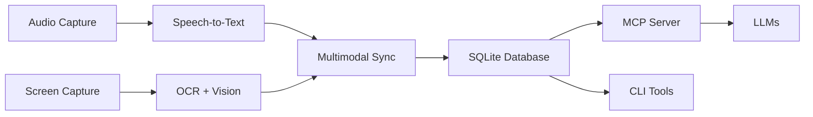

# Savant AI Documentation

Comprehensive documentation for the Savant AI multimodal assistant.

## Getting Started

### New Users
- **[Quick Start](quickstart/)** - Get running in minutes
- **[Setup Guide](SETUP_GUIDE.md)** - Complete installation and configuration

### Essential Guides
- **[Permissions Setup](guides/permissions.md)** - macOS system permissions
- **[Audio Setup](guides/audio-setup.md)** - System audio capture configuration
- **[CLI Tools](reference/cli-tools.md)** - Command line reference

## Documentation Structure

### 📚 [Quick Start](quickstart/)
Fast setup and initial configuration for new users.

### 📖 [User Guides](guides/)
Task-oriented guides for specific functionality:
- **[Permissions](guides/permissions.md)** - macOS system permissions setup
- **[Audio Setup](guides/audio-setup.md)** - BlackHole and system audio configuration  
- **[MCP Integration](guides/mcp-integration.md)** - Model Context Protocol for LLM access

### 📘 [Reference](reference/)
Detailed technical reference documentation:
- **[CLI Tools](reference/cli-tools.md)** - Complete command reference
- **[Audio Transcription](reference/audio-transcription.md)** - Speech-to-text processing
- **[Database System](reference/database.md)** - SQLite schema and operations
- **[Configuration](reference/configuration.md)** - Configuration files and options

### 🏗️ [Architecture](architecture/)
System design and architectural documentation:
- **[System Overview](architecture/overview.md)** - High-level architecture
- **[Components](architecture/components.md)** - Component specifications
- **[Design Principles](architecture/principles.md)** - UNIX philosophy and decisions

### 🔧 [Development](development/)
Documentation for developers and contributors:
- **[Implementation Summary](development/implementation-summary.md)** - Current status
- **[UNIX Philosophy](development/unix-philosophy.md)** - Design principles
- **[Implementation Details](development/implementation/)** - Technical deep-dives

## Quick Reference

### Common Commands
```bash
# Setup and start
./setup                           # Automated setup
./start-daemons                   # Start all systems
./monitor-daemons                 # Real-time monitoring

# Individual components
./sav start|stop|status|logs      # Audio daemon
./sav-video start|stop|status     # Video daemon

# CLI tools
cargo run --package savant-ocr -- extract --input image.png --fast
cargo run --package savant-vision -- analyze --input image.png --detect-apps
cargo run --package savant-db -- list --limit 10
```

### System Files
```
~/.config/savant-ai/config.toml          # Configuration
~/.config/savant-ai/transcripts.db       # Database
~/.config/savant-ai/daemon-logs/         # Daemon logs
~/Library/Application Support/savant-ai/ # macOS data directory
```

## Architecture Overview



## Core Features

### 🎙️ Audio Processing
- Real-time speech-to-text transcription
- Speaker identification and analytics
- System audio capture (BlackHole integration)
- Multi-language support

### 📹 Video Analysis
- Stealth screen capture with configurable intervals
- OCR text extraction with semantic classification
- Computer vision for app detection and activity classification
- Privacy controls and blocked application filtering

### 🔄 Multimodal Intelligence
- Audio-video event correlation and synchronization
- Context-aware timeline management
- Proactive assistance based on detected activities
- Workflow pattern recognition and optimization

### 🗄️ Data Management
- SQLite database with full-text search
- Natural language queries via MCP server
- Privacy-first local storage with encryption
- Configurable retention and cleanup policies

### 🛠️ Developer Tools
- UNIX-philosophy CLI tools with JSON I/O
- Composable pipeline processing
- Model Context Protocol (MCP) for LLM integration
- Extensible plugin architecture

## Design Principles

### UNIX Philosophy
1. **Do One Thing Well**: Each tool has a single, clear purpose
2. **Work Together**: Tools compose via pipes and standard interfaces
3. **Text Streams**: Universal interface for data exchange
4. **Build on Others**: Leverage existing tools and standards

### Privacy & Security
- **Local-First**: All processing happens on your device by default
- **User Control**: Explicit consent for data sharing and cloud features
- **Transparent**: Clear data handling and storage policies
- **Secure**: Encrypted storage and validated query processing

### Performance & Reliability
- **Real-Time**: <5s latency for interactive features
- **Efficient**: Optimized data structures and algorithms
- **Fault-Tolerant**: Graceful degradation and error recovery
- **Scalable**: Resource-aware scaling and configurable trade-offs

## Support

### Getting Help
1. **Check Documentation**: Start with relevant guide or reference
2. **Run Diagnostics**: Use `./verify-permissions` and `./test-systems`
3. **View Logs**: Check daemon logs with `./monitor-daemons`
4. **Search Issues**: Check GitHub issues for known problems

### Common Issues
- **Permissions**: Run `./verify-permissions` for macOS setup
- **Audio**: Check microphone permissions and device configuration
- **Video**: Ensure Screen Recording permission is granted
- **Performance**: Use `--fast` flags and resize large images

### Contributing
- See [Development Documentation](development/) for contributor guidelines
- Follow UNIX principles for new CLI tools
- Include tests and documentation for new features
- Use structured logging and error handling

## Links

- **[Main Repository](../../)** - Source code and issues
- **[CLAUDE.md](../../CLAUDE.md)** - Project overview and quick commands
- **[Setup Scripts](../../scripts/)** - Automation and management scripts
- **[CLI Tools](../../crates/)** - Individual tool documentation

---

**Navigation**: Use the links above to explore specific documentation sections, or start with the [Quick Start](quickstart/) guide for immediate setup.