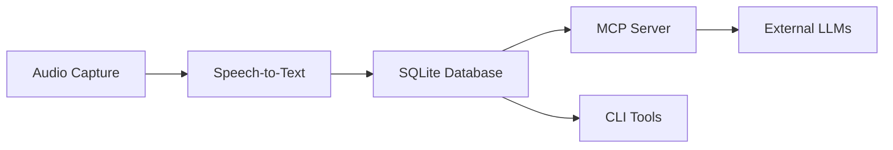

# Savant AI Documentation

## Core Documentation

- **[CLI Tools](cli-tools.md)** - UNIX philosophy tools + MCP server
- **[Database System](database.md)** - SQLite with speaker ID + analytics
- **[Audio Transcription](audio-transcription.md)** - Real-time speech-to-text
- **[MCP Integration](llm-database-integration-plan.md)** - Model Context Protocol implementation
- **[Deprecations](deprecations.md)** - Deprecated features and migration guide

## User Guides

- **[Getting Started](user-guides/GETTING_STARTED.md)** - Quick setup
- **[System Audio Setup](user-guides/SYSTEM_AUDIO_SETUP.md)** - Audio capture configuration

## Architecture



## Quick Commands

### Audio Pipeline
```bash
./sav start                    # Background daemon
savant-transcribe --speaker "user" --duration 10
```

### Database Queries
```bash
savant-db --db-path ~/.config/savant-ai/transcripts.db list --limit 10
savant-db --db-path ./data.db query --speaker "john" --text "meeting"
savant-db --db-path ~/.config/savant-ai/transcripts.db stats
```

### MCP Server
```bash
savant-mcp --test             # Test mode
savant-mcp --llm-provider ollama  # Production
```

### Development
```bash
cargo tauri dev                              # Full app
cargo test --workspace                      # All tests
./scripts/tests/test-mcp-natural-queries.sh # MCP integration test
./scripts/tests/test-database-sql.sh        # Database test
```

## Features

- **Speaker ID**: Text-pattern + voice biometric framework
- **Analytics**: Topic extraction, sentiment, relationships
- **Natural Language**: Plain English database queries
- **MCP Integration**: External LLM access via JSON-RPC 2.0
- **UNIX Tools**: Composable CLI with JSON I/O
- **Security**: Query validation + rate limiting

## Storage

- Database: `~/.config/savant-ai/transcripts.db`
- Config: `~/.config/savant-ai/config.toml`
- Audio: `~/Documents/savant-ai/data/`

## Architecture Principles

1. **UNIX Philosophy**: Single-purpose, composable tools
2. **Privacy-First**: Local processing, encrypted storage
3. **Real-Time**: <5s latency for speaker identification
4. **Scalable**: Time-series optimization + vector search ready