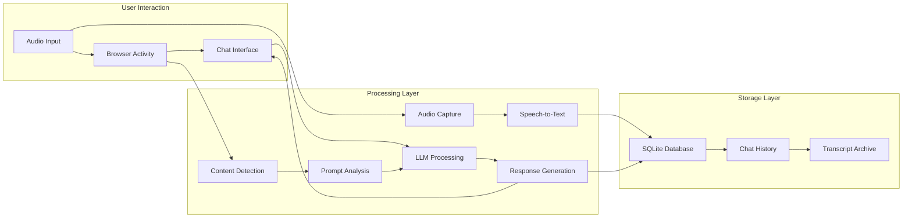
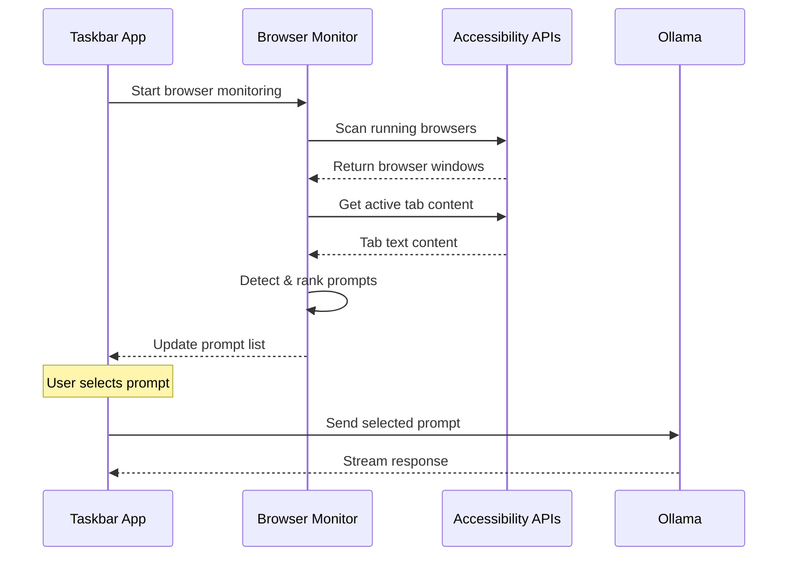

# Savant AI - Architecture & Setup

## System Architecture

Savant AI implements a hybrid architecture combining modern desktop app features with UNIX philosophy CLI tools:

### Core Components

- **Frontend**: Leptos 0.7 WASM application with reactive taskbar UI
- **Backend**: Tauri 2.0 Rust application with modular command system
- **AI Integration**: Multi-provider LLM support (Ollama, OpenAI, DeepSeek, Anthropic)
- **Audio Transcription**: Real-time capture and Whisper-based speech-to-text
- **Database System**: SQLite-based storage for conversation history
- **Browser Monitoring**: macOS Accessibility API integration
- **Stealth System**: OS-level window manipulation for invisibility

### Application Flow



## Development Setup

### Prerequisites

```bash
# Rust toolchain
curl --proto '=https' --tlsv1.2 -sSf https://sh.rustup.rs | sh

# Frontend build tools
npm install -g trunk

# Local AI
brew install ollama
ollama pull devstral
ollama serve &
```

### Development Commands

#### Full Stack Development
```bash
# Primary development (recommended)
cargo tauri dev

# Frontend only
trunk serve  # localhost:1420

# Production builds
cargo tauri build --release
```

#### Testing & Quality
```bash
# Run all tests
cargo test --workspace

# Specific crate testing
cargo test --package savant-stt
cargo test --package savant-transcribe

# Code quality
cargo check --workspace
cargo clippy --workspace
```

### Platform-Specific Notes

#### macOS
- Requires `macOSPrivateApi: true` in tauri.conf.json for stealth features
- Accessibility permissions needed for browser monitoring
- Whisper models stored in `models/` directory

#### Windows/Linux
- Win32/X11 APIs for window manipulation
- CPAL for cross-platform audio capture
- Limited browser monitoring capabilities

## Workspace Structure

```
savant-ai/
├── Cargo.toml                  # Workspace root
├── CLAUDE.md                   # AI development guidance
├── src/                        # Frontend (Leptos WASM)
│   ├── main.rs
│   ├── taskbar_app.rs
│   ├── components/
│   └── utils/
├── src-tauri/                  # Desktop backend (Tauri)
│   ├── src/commands/
│   ├── tauri.conf.json
│   └── Cargo.toml
├── crates/                     # UNIX CLI tools
│   ├── savant-core/           # Shared types & utilities
│   ├── savant-llm/            # LLM inference CLI
│   ├── savant-audio/          # Audio capture
│   ├── savant-stt/            # Speech-to-text
│   ├── savant-transcribe/     # CLI transcription
│   └── savant-db/             # Database management
└── docs/                       # Documentation
```

## Configuration Management

### Application Settings
Configuration stored in `~/.config/savant-ai/config.toml`:

```toml
[ai_providers]
default_provider = "ollama"
ollama_endpoint = "http://localhost:11434"
openai_api_key = ""
deepseek_api_key = ""

[stealth_settings]
stealth_mode_enabled = true
window_transparency = 0.9
always_on_top = true

[hotkeys]
toggle_overlay = "CommandOrControl+Shift+A"
screenshot_analyze = "CommandOrControl+Shift+S" 
show_dashboard = "CommandOrControl+Shift+D"

[transcription]
default_language = "en"
auto_speaker_detection = true
silence_threshold = 0.1
model_path = "models/ggml-base.en.bin"
```

### Global Hotkeys
| Shortcut | Function |
|----------|----------|
| `Cmd+Shift+A` | Toggle AI overlay scanning |
| `Cmd+Shift+S` | Trigger immediate screenshot analysis |
| `Cmd+Shift+D` | Show/hide configuration dashboard |

## Browser Monitoring Architecture

### How It Works


### Browser Support
- ✅ **Chrome/Chromium**: Full content extraction
- ✅ **Microsoft Edge**: Via Chromium engine
- ✅ **Arc Browser**: Chromium-based support
- 🔄 **Safari**: Planned via AppleScript integration

## Performance Considerations

### Audio Processing
- CPU-intensive Whisper processing (consider GPU acceleration)
- Real-time vs batch processing tradeoffs
- Model size vs accuracy balance

### Browser Monitoring
- Configurable scanning frequency for performance
- Content caching to reduce API calls
- Selective browser process monitoring

### Database Operations
- SQLite with proper indexing for fast queries
- FTS (Full-Text Search) for content searching
- Connection pooling for concurrent access

## Error Handling & Logging

### Logging Strategy
```rust
// Use structured logging with tracing
use tracing::{info, warn, error, debug};

// Log levels by component:
// ERROR: System failures, permission issues
// WARN: Model loading issues, API failures  
// INFO: User actions, session starts
// DEBUG: Detailed processing steps
```

### Error Recovery
- Graceful degradation when AI services unavailable
- Fallback to cached data when database inaccessible
- Retry logic for transient failures
- User notification for permission issues

## Security Considerations

### Data Protection
- Local-only processing by default
- Encrypted storage for API keys
- No external data transmission unless explicitly configured
- Audio data processing in memory (no disk caching)

### Permission Management
- macOS Accessibility API permissions
- Microphone access permissions
- System audio capture permissions
- File system access for database storage

## Future Architecture Plans

### Planned Enhancements
- **Real-time Streaming**: Live transcription with immediate database storage
- **Voice Profiles**: Speaker recognition based on voice characteristics
- **Semantic Search**: Embedding-based content search beyond keyword matching
- **Plugin System**: Extension architecture for custom processing pipelines
- **Multi-Platform**: Full Windows and Linux support
- **Cloud Sync**: Optional encrypted cloud backup for conversations