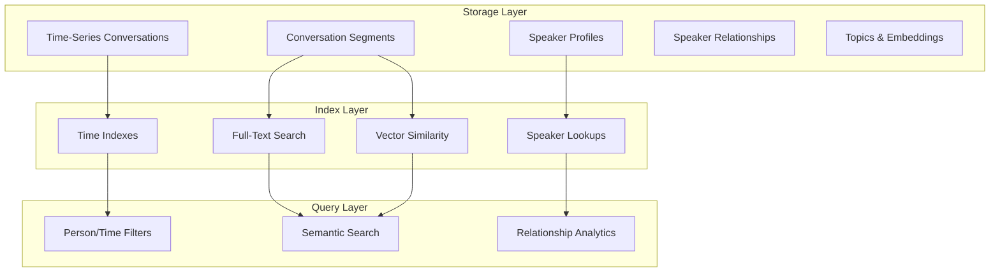

# Database System

Advanced SQLite-based conversation storage with speaker identification, semantic search, and relationship analytics.

## Architecture Overview



## Core Schema

### Speaker Management
```sql
-- Speaker profiles with voice biometrics
CREATE TABLE speakers (
    id TEXT PRIMARY KEY,
    name TEXT,                          -- Display name
    voice_embedding BLOB,               -- 512-dim voice signature
    text_patterns TEXT,                 -- JSON: common phrases
    confidence_threshold REAL DEFAULT 0.75,
    total_conversation_time REAL DEFAULT 0.0,
    total_conversations INTEGER DEFAULT 0,
    last_interaction TIMESTAMPTZ,
    created_at TIMESTAMPTZ DEFAULT NOW()
);

-- Speaker relationship analytics
CREATE TABLE speaker_relationships (
    speaker_a_id TEXT REFERENCES speakers(id),
    speaker_b_id TEXT REFERENCES speakers(id),
    total_conversations INTEGER DEFAULT 0,
    total_duration REAL DEFAULT 0.0,
    last_conversation TIMESTAMPTZ,
    common_topics TEXT,                 -- JSON array
    relationship_strength REAL,         -- 0-1 calculated metric
    PRIMARY KEY (speaker_a_id, speaker_b_id),
    CHECK (speaker_a_id < speaker_b_id)
);
```

### Conversation Storage
```sql
-- Time-partitioned conversation containers
CREATE TABLE conversations (
    id UUID PRIMARY KEY,
    start_time TIMESTAMPTZ NOT NULL,   -- Partition key
    end_time TIMESTAMPTZ,
    participant_ids UUID[],             -- Array of speaker IDs
    summary TEXT,
    topics JSONB,                       -- ["work", "project_alpha"]
    sentiment_score REAL,
    quality_score REAL,
    participant_count INTEGER DEFAULT 0
);

-- Individual speech segments with speaker attribution
CREATE TABLE conversation_segments (
    id UUID PRIMARY KEY,
    conversation_id UUID REFERENCES conversations(id),
    speaker_id UUID REFERENCES speakers(id),
    start_time REAL NOT NULL,           -- Relative to conversation
    end_time REAL NOT NULL,
    original_text TEXT,                 -- Raw transcription
    processed_text TEXT,                -- Cleaned/normalized
    semantic_embedding BLOB,            -- 384-dim for similarity search
    confidence REAL,
    timestamp TIMESTAMPTZ NOT NULL      -- Absolute time
);
```

### Performance Indexes
```sql
-- Time-based partitioning and filtering
CREATE INDEX idx_conversations_time ON conversations(start_time);
CREATE INDEX idx_segments_timestamp ON conversation_segments(timestamp);

-- Speaker-based queries
CREATE INDEX idx_segments_speaker_time ON conversation_segments(speaker_id, timestamp);
CREATE INDEX idx_conversations_participants ON conversations USING GIN(participant_ids);

-- Full-text search with speaker attribution
CREATE VIRTUAL TABLE segments_fts USING fts5(
    original_text, processed_text, speaker_name,
    content='conversation_segments'
);

-- Vector similarity (prepared for semantic search)
CREATE INDEX idx_segments_embedding ON conversation_segments 
USING ivfflat (semantic_embedding vector_cosine_ops);
```

## Query Patterns

### Person-Based Filtering
```bash
# All conversations with specific person
savant-db query --speaker "john_doe" --limit 50

# Conversations between two people
savant-db query --participants "john_doe,jane_smith" --sort time-desc

# Speaker relationship analysis
savant-db speaker show john_doe  # Shows interaction stats
```

```sql
-- Optimized speaker filtering
SELECT c.*, array_agg(s.name) as participants
FROM conversations c
JOIN speakers s ON s.id = ANY(c.participant_ids)
WHERE 'john-uuid' = ANY(c.participant_ids)
  AND c.start_time >= $1
ORDER BY c.start_time DESC;
```

### Time-Based Sorting
```bash
# Recent conversations (uses time partitioning)
savant-db list --limit 20 --sort time-desc

# Specific time range
savant-db query --start "2025-07-01T00:00:00Z" --end "2025-07-01T23:59:59Z"

# Speaker timeline analysis
savant-db analyze timeline --speaker "john_doe" --timeframe weekly
```

### Semantic Search
```bash
# Text-based semantic search
savant-db search "project meeting discussion" --limit 10 --threshold 0.7

# Speaker-filtered semantic search
savant-db search "deadline concerns" --speaker "manager" --limit 5

# Cross-conversation topic search
savant-db topic extract conversation-id
savant-db topic list conversation-id
```

### Analytics Queries
```bash
# Speaker statistics
savant-db speaker list                    # All speakers with stats
savant-db speaker duplicates              # Find potential duplicates
savant-db speaker merge primary secondary # Merge speaker profiles

# Conversation analysis
savant-db analyze conversation-id         # Extract insights
savant-db stats                          # Overall database statistics
```

## Data Structures

### Speaker Index (In-Memory)
```rust
pub struct SpeakerIndex {
    // Fast speaker lookup
    speaker_conversations: HashMap<SpeakerId, BTreeSet<ConversationId>>,
    
    // Time-ordered per speaker
    speaker_timeline: HashMap<SpeakerId, BTreeMap<DateTime<Utc>, ConversationId>>,
    
    // Relationship graph
    relationship_graph: HashMap<SpeakerId, HashMap<SpeakerId, RelationshipMetrics>>,
    
    // Voice embedding cache
    voice_embeddings: HashMap<SpeakerId, Array1<f32>>,
}
```

### Hierarchical Time Index
```rust
pub struct ConversationIndex {
    // Year → Month → Day hierarchy
    yearly_index: HashMap<i32, MonthlyIndex>,
    monthly_index: HashMap<(i32, u32), DailyIndex>, 
    daily_index: HashMap<NaiveDate, Vec<ConversationId>>,
    
    // Hot data cache (last 7 days)
    recent_conversations: LruCache<ConversationId, Conversation>,
}
```

### Semantic Search Engine
```rust
pub struct SemanticSearchEngine {
    // Vector similarity cache
    embedding_cache: HashMap<String, Array1<f32>>,
    
    // Topic extraction and analysis
    topic_model: TopicExtractor,
    sentiment_analyzer: SentimentAnalyzer,
}
```

## Performance Optimizations

### Query Optimization
```sql
-- GOOD: Uses indexes efficiently
SELECT * FROM conversations 
WHERE 'speaker-uuid' = ANY(participant_ids) 
  AND start_time >= '2025-01-01'::timestamptz 
ORDER BY start_time DESC LIMIT 20;

-- GOOD: FTS for text search
SELECT * FROM segments_fts 
WHERE segments_fts MATCH 'project AND meeting'
  AND timestamp >= '2025-01-01';

-- BAD: Full table scan
SELECT * FROM conversation_segments 
WHERE original_text LIKE '%meeting%';
```

### Caching Strategy
```rust
// Multi-level caching
pub struct ConversationCache {
    // Hot data (last 7 days) in memory
    recent_conversations: LruCache<ConversationId, Conversation>,
    
    // Speaker embeddings for fast similarity
    speaker_embeddings: HashMap<SpeakerId, Array1<f32>>,
    
    // Relationship data cache
    relationship_cache: LruCache<(SpeakerId, SpeakerId), RelationshipMetrics>,
    
    // Bloom filter for existence checks
    conversation_bloom: BloomFilter<ConversationId>,
}
```

### Storage Efficiency
```sql
-- Compression for older data
ALTER TABLE conversations SET (
    timescaledb.compress,
    timescaledb.compress_segmentby = 'participant_count',
    timescaledb.compress_orderby = 'start_time DESC'
);

-- Retention policies
SELECT add_retention_policy('conversations', INTERVAL '2 years');
```

## Speaker Name Assignment

### Voice Pattern Recognition
```rust
// Text-based speaker identification
pub fn identify_speaker_by_text(&self, text: &str) -> Option<SpeakerMatch> {
    // Voice assistant commands → user
    if text.contains("hey siri") || text.contains("ok google") {
        return Some(SpeakerMatch {
            speaker_id: "user".to_string(),
            confidence: 0.8,
            method: MatchMethod::TextPatterns,
        });
    }
    
    // System notifications → computer
    if text.contains("notification") || text.contains("alert") {
        return Some(SpeakerMatch {
            speaker_id: "system".to_string(),
            confidence: 0.7,
            method: MatchMethod::TextPatterns,
        });
    }
}
```

### Voice Biometric Framework
```rust
// Infrastructure for ML-based speaker identification
pub struct VoiceEmbedding {
    pub vector: Array1<f32>,      // 512-dimensional voice signature
    pub speaker_id: String,
    pub confidence: f32,
}

pub fn identify_speaker(&self, embedding: &Array1<f32>) -> Option<SpeakerMatch> {
    // Compare against known voice signatures using cosine similarity
    // Implementation ready for pyannote-audio integration
}
```

### Progressive Learning
```bash
# Manual speaker assignment during recording
savant-transcribe --speaker "john_doe" --duration 60

# Post-recording identification and merging
savant-db speaker list                    # Shows anonymous speakers
savant-db speaker create --name "John Doe" # Create named speaker
savant-db speaker merge anonymous-id named-id # Merge profiles
```

## CLI Reference

### Core Operations
```bash
# Store transcriptions with speaker attribution
savant-transcribe --speaker "user" | savant-db store --title "Voice Note"

# Query with multiple filters
savant-db query --speaker "john_doe" --text "meeting" --start "2025-07-01T00:00:00Z"

# Semantic search across all conversations
savant-db search "project deadline discussion" --limit 10 --threshold 0.7
```

### Speaker Management
```bash
savant-db speaker list                    # List all speakers with statistics
savant-db speaker create --name "John"    # Create new speaker profile
savant-db speaker show speaker-id         # Show detailed speaker information
savant-db speaker duplicates              # Find potential duplicate speakers
savant-db speaker merge primary secondary # Merge two speaker profiles
```

### Analytics & Insights
```bash
savant-db analyze conversation-id         # Extract conversation insights
savant-db stats                          # Overall database statistics
savant-db topic list conversation-id     # Show conversation topics
savant-db topic extract conversation-id  # Extract topics automatically
```

### Export & Integration
```bash
savant-db export conversation-id --output analysis.json
savant-db list --limit 50 | jq '.[] | .summary'
```

## Integration Examples

### Real-Time Pipeline
```bash
# Continuous audio processing with speaker identification
./sav start  # Background daemon captures audio
# → Transcription with speaker patterns
# → Automatic database storage
# → Real-time speaker relationship updates
```

### Batch Analysis
```bash
# Process historical recordings
find recordings/ -name "*.wav" | while read file; do
  savant-transcribe --input "$file" --speaker "archive" | 
  savant-db store --title "Archive: $(basename "$file")"
done

# Analyze speaker relationships
savant-db speaker list | jq -r '.[].id' | while read speaker; do
  savant-db analyze relationships --speaker "$speaker"
done
```

### External Integration
```bash
# Export for external analysis
savant-db export-all --format json | 
curl -X POST -H "Content-Type: application/json" \
     -d @- https://analytics-service.com/conversations

# Import from meeting platforms
curl -s "https://api.zoom.us/v2/meetings/transcripts" |
jq '.transcripts[]' |
savant-db store --title "Zoom Import"
```

## Future Enhancements

### ML Integration (Planned)
- **PyAnnote-Audio**: Voice embedding generation for speaker identification
- **Sentence Transformers**: Semantic embeddings for advanced search
- **Speaker Diarization**: Automatic speaker separation in multi-person recordings

### Advanced Analytics (Planned)
- **Relationship Strength**: Calculate interaction frequency and patterns
- **Topic Evolution**: Track how discussion topics change over time
- **Sentiment Trends**: Analyze emotional patterns in conversations

### Distributed Architecture (Planned)
- **TimescaleDB**: Time-series optimization for large-scale deployments
- **Vector Databases**: Dedicated similarity search infrastructure
- **MCP Server**: Model Context Protocol integration for LLM queries

The database system provides a solid foundation for intelligent conversation management while maintaining the project's UNIX philosophy and privacy-first approach.