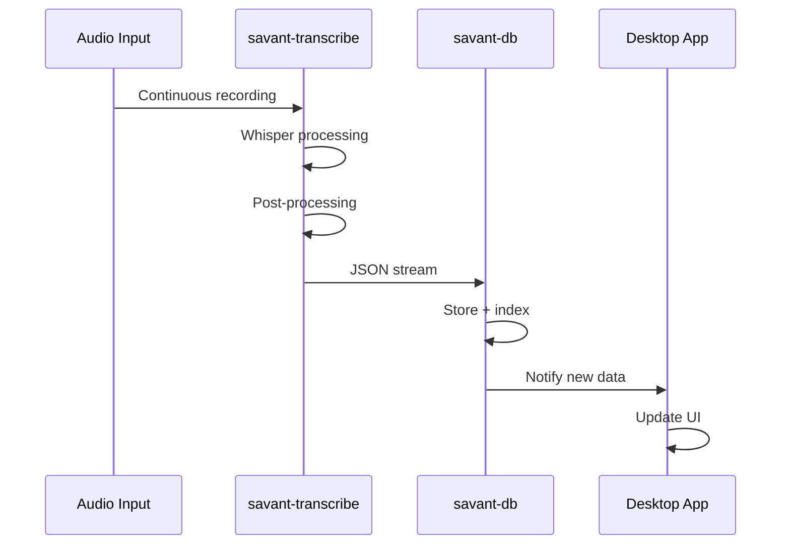

# Database System

Comprehensive guide to Savant AI's SQLite-based database system for conversation history, transcript analytics, and rich querying capabilities.

## Overview

The database system provides persistent storage for transcription data with full-text search, conversation grouping, and speaker analytics. Built on SQLite with FTS (Full-Text Search) for efficient content querying.

### Key Features

- **Conversation Grouping**: Related transcript segments organized by conversation
- **Speaker Analytics**: Track time spent, segment counts, and confidence by speaker
- **Full-Text Search**: Fast content searching across all transcripts
- **Rich Querying**: Complex filters by speaker, time, content, and metadata
- **Export Capabilities**: JSON export for external data processing
- **Migration Tools**: Convert existing markdown files to database (planned)

## Database Schema

### Core Tables

```sql
-- Conversations table for grouping related segments
CREATE TABLE conversations (
    id TEXT PRIMARY KEY,              -- UUID
    title TEXT,                       -- User-friendly title
    start_time DATETIME NOT NULL,     -- First segment timestamp
    end_time DATETIME,                -- Last segment timestamp  
    context TEXT,                     -- Additional description
    created_at DATETIME DEFAULT CURRENT_TIMESTAMP
);

-- Transcript segments table
CREATE TABLE segments (
    id TEXT PRIMARY KEY,              -- UUID
    conversation_id TEXT NOT NULL,    -- Foreign key to conversations
    timestamp DATETIME NOT NULL,      -- When segment was recorded
    speaker TEXT NOT NULL,            -- Speaker identifier
    audio_source TEXT NOT NULL,       -- JSON: AudioSource enum
    text TEXT NOT NULL,               -- Transcribed text content
    start_time REAL NOT NULL,         -- Relative time within segment
    end_time REAL NOT NULL,           -- Relative time within segment
    confidence REAL,                  -- Optional confidence score
    metadata TEXT,                    -- Full TranscriptionResult JSON
    created_at DATETIME DEFAULT CURRENT_TIMESTAMP,
    FOREIGN KEY (conversation_id) REFERENCES conversations(id) ON DELETE CASCADE
);

-- Future: Participants table for speaker management
CREATE TABLE participants (
    id TEXT PRIMARY KEY,
    name TEXT NOT NULL UNIQUE,
    voice_profile TEXT,               -- For speaker recognition
    metadata TEXT,                    -- Additional speaker data
    created_at DATETIME DEFAULT CURRENT_TIMESTAMP
);
```

### Indexes for Performance

```sql
-- Core performance indexes
CREATE INDEX idx_segments_conversation_id ON segments(conversation_id);
CREATE INDEX idx_segments_timestamp ON segments(timestamp);
CREATE INDEX idx_segments_speaker ON segments(speaker);
CREATE INDEX idx_segments_audio_source ON segments(audio_source);
CREATE INDEX idx_conversations_start_time ON conversations(start_time);

-- Full-text search index
CREATE VIRTUAL TABLE segments_fts USING fts5(
    text,
    content='segments',
    content_rowid='rowid'
);
```

## Database Operations

### Storage Operations

#### Store Transcription Data
```bash
# Store from transcription pipeline
savant-transcribe --speaker "user" --duration 30 | \
savant-db store --title "Voice Note"

# Store with context
echo '{"text":"Meeting notes","segments":[...]}' | \
savant-db store --title "Team Standup" --context "Daily sync meeting"

# Add to existing conversation
savant-transcribe --speaker "presenter" | \
savant-db store --conversation "existing-conv-id"
```

#### Manual Conversation Management
```bash
# Create new conversation
savant-db create --title "Interview Session" --context "Technical interview"

# Returns: Created conversation: uuid-here
```

### Query Operations

#### Basic Queries
```bash
# List recent conversations
savant-db list --limit 20

# Query by speaker
savant-db query --speaker "john_doe" --limit 50

# Search content
savant-db query --text "project alpha discussion"
```

#### Advanced Filtering
```bash
# Time-based queries
savant-db query --start "2025-07-01T00:00:00Z" --end "2025-07-01T23:59:59Z"

# Combined filters
savant-db query --speaker "user" --text "meeting" --limit 20 --offset 40

# Audio source filtering
savant-db query --audio-source "SystemAudio" --start "2025-07-01T09:00:00Z"
```

#### Full-Text Search
```bash
# Content search with ranking
savant-db search "quantum computing discussion" --limit 10

# Search within specific conversations
savant-db search "action items" --conversation "meeting-conv-id"

# Search with speaker filter
savant-db search "project deadline" --speaker "manager"
```

### Analytics Operations

#### Speaker Statistics
```bash
# Overall speaker stats
savant-db stats

# Output example:
# Speaker          Conversations  Total Time    Segments  Avg Confidence
# user             45             2.5 hours     892       0.87
# system           23             1.2 hours     445       0.92
# john_doe         12             0.8 hours     234       0.85
```

#### Conversation Analytics
```bash
# Conversation duration analysis
savant-db analyze duration --speaker "user" --days 30

# Speaking pattern analysis
savant-db analyze patterns --conversation "meeting-id"

# Confidence trends
savant-db analyze confidence --start "2025-07-01T00:00:00Z"
```

### Export Operations

#### JSON Export
```bash
# Export single conversation
savant-db export conversation-id-123 --output analysis.json

# Export with filters
savant-db query --speaker "user" --start "2025-07-01T00:00:00Z" | \
jq '.' > daily_transcripts.json

# Bulk export
savant-db export-all --format json --output bulk_export.json
```

#### Format Conversion
```bash
# Convert to CSV for spreadsheet analysis
savant-db query --speaker "user" | \
jq -r '.[] | [.timestamp, .speaker, .text, .confidence] | @csv' > transcripts.csv

# Generate markdown reports
savant-db export conversation-id --format markdown > meeting_notes.md
```

## Data Pipeline Integration

### Real-Time Pipeline



### Batch Processing Pipeline

```bash
# Process existing audio files
find recordings/ -name "*.wav" | \
while read file; do
  echo "Processing: $file"
  savant-transcribe --input "$file" --speaker "archive" | \
  savant-db store --title "Archive: $(basename "$file")"
done

# Import from external systems
curl -s "https://api.meeting-service.com/transcripts" | \
jq '.transcripts[]' | \
while read -r transcript; do
  echo "$transcript" | savant-db store --title "External Import"
done
```

### Data Validation Pipeline

```bash
# Validate data integrity
savant-db validate --check-conversations
savant-db validate --check-fts-sync
savant-db validate --check-timestamps

# Repair common issues
savant-db repair --rebuild-fts
savant-db repair --fix-orphaned-segments
```

## Performance Optimization

### Query Optimization

#### Use Appropriate Indexes
```sql
-- Good: Uses timestamp index
SELECT * FROM segments WHERE timestamp > '2025-07-01' ORDER BY timestamp;

-- Bad: Full table scan
SELECT * FROM segments WHERE text LIKE '%meeting%';

-- Better: Use FTS for text search
SELECT * FROM segments_fts WHERE segments_fts MATCH 'meeting';
```

#### Pagination for Large Results
```bash
# Good: Paginated results
savant-db query --speaker "user" --limit 50 --offset 100

# Bad: Loading all results
savant-db query --speaker "user"  # Could return thousands
```

### Storage Optimization

#### Database Maintenance
```bash
# Vacuum database to reclaim space
savant-db maintenance --vacuum

# Analyze query performance
savant-db maintenance --analyze

# Rebuild FTS index
savant-db maintenance --rebuild-fts
```

#### Archival Strategy
```bash
# Archive old conversations
savant-db archive --older-than "2024-01-01" --output archive_2024.json

# Compress archived data
savant-db archive --older-than "2024-01-01" | gzip > archive_2024.json.gz
```

## Migration & Data Import

### Legacy Markdown Import

```bash
# Import existing markdown files (planned feature)
find ~/Documents/transcripts/ -name "*.md" | \
savant-db import-markdown --speaker "user"

# Batch import with metadata extraction
savant-db import-markdown --directory "transcripts/" --auto-detect-speakers
```

### External System Integration

```bash
# Import from Otter.ai exports
savant-db import-otter --file "otter_export.json" --speaker-mapping "mapping.json"

# Import from Zoom transcripts
savant-db import-zoom --directory "zoom_transcripts/" --meeting-metadata
```

### Data Format Migration

```bash
# Convert old JSON format to new schema
savant-db migrate --from-version "0.1" --to-version "0.2"

# Validate migration results
savant-db validate --post-migration
```

## Backup & Recovery

### Backup Strategies

```bash
# Simple database backup
cp ~/.config/savant-ai/transcripts.db backup_$(date +%Y%m%d).db

# Export-based backup
savant-db export-all --format json | gzip > backup_$(date +%Y%m%d).json.gz

# Incremental backup (future feature)
savant-db backup --incremental --since "2025-07-01T00:00:00Z"
```

### Cloud Backup Integration

```bash
# S3 backup
savant-db export-all --format json | \
gzip | \
aws s3 cp - s3://backup-bucket/transcripts-$(date +%Y%m%d).json.gz

# Encrypted backup
savant-db export-all --format json | \
gpg --encrypt --recipient "your@email.com" | \
gzip > encrypted_backup_$(date +%Y%m%d).gpg.gz
```

### Recovery Procedures

```bash
# Restore from backup
savant-db restore --from-file "backup_20250701.json.gz"

# Partial restore
savant-db restore --from-file "backup.json.gz" --conversation-filter "meeting-*"

# Verify restore integrity
savant-db validate --full-check
```

## Configuration

### Database Settings

```toml
# In ~/.config/savant-ai/config.toml
[database]
path = "~/.config/savant-ai/transcripts.db"
backup_interval = "24h"
vacuum_interval = "weekly"
max_connections = 10
cache_size = "64MB"

[analytics]
enable_speaker_tracking = true
confidence_threshold = 0.7
auto_conversation_grouping = true
conversation_timeout = "30m"
```

### Performance Tuning

```sql
-- SQLite optimization pragmas
PRAGMA journal_mode = WAL;           -- Write-Ahead Logging
PRAGMA synchronous = NORMAL;         -- Balance safety/performance  
PRAGMA cache_size = 10000;           -- 40MB cache
PRAGMA temp_store = memory;          -- Temp tables in RAM
PRAGMA mmap_size = 268435456;        -- 256MB memory mapping
```

## Security & Privacy

### Data Protection

```bash
# Encrypt database file (future feature)
savant-db encrypt --password-file "/secure/path/password"

# Anonymize speaker data
savant-db anonymize --speaker-mapping "real_name->speaker_001"

# Selective data deletion
savant-db delete --speaker "sensitive_speaker" --confirm
```

### Access Control

```bash
# Set database permissions
chmod 600 ~/.config/savant-ai/transcripts.db

# Audit access patterns
savant-db audit --show-access-log

# Export audit trail
savant-db audit --export-log --output audit_$(date +%Y%m%d).json
```

## Troubleshooting

### Common Issues

#### Database Lock Errors
```bash
# Check for blocking processes
savant-db status --show-connections

# Force unlock (use carefully)
savant-db maintenance --force-unlock
```

#### Corruption Recovery
```bash
# Check database integrity
savant-db validate --integrity-check

# Repair corruption
savant-db repair --from-backup "backup.db"
```

#### Performance Issues
```bash
# Analyze slow queries
savant-db analyze --slow-queries --threshold 1000ms

# Rebuild indexes
savant-db maintenance --rebuild-indexes
```

### Debug Commands

```bash
# Verbose database operations
RUST_LOG=debug savant-db query --speaker "user"

# SQL execution tracing
RUST_LOG=sqlx=trace savant-db list --limit 5

# Performance profiling
savant-db profile --operation "complex_query" --iterations 100
```

## Future Enhancements

### Planned Features

- **Real-time Sync**: Live database updates during transcription
- **Distributed Storage**: Multi-device synchronization
- **Advanced Analytics**: ML-based speaker recognition and sentiment analysis
- **API Server**: REST API for external integrations
- **Graph Database**: Conversation relationship modeling
- **Vector Search**: Semantic similarity search with embeddings