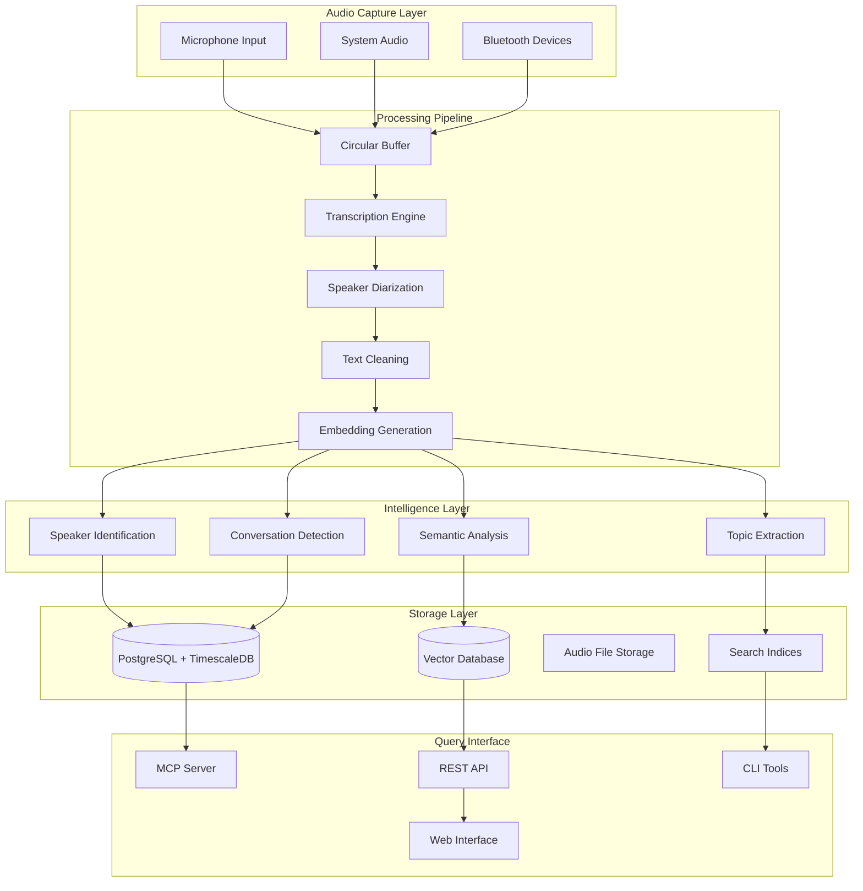

# Smart Database Pipeline: Audio Transcripts to Intelligent Conversation Storage

## Executive Summary

This document outlines the design and implementation of a comprehensive data pipeline that transforms raw audio transcripts into an intelligent, queryable conversation database with speaker identification and semantic search capabilities. The system creates an "intelligent rolodex" that tracks every conversation with individual people over time, enabling sophisticated queries, relationship analytics, and MCP server integration.

## Core Design Principles

### UNIX Philosophy Integration
- **Composable Tools**: Each component operates as an independent CLI tool
- **JSON I/O**: Standardized input/output for pipeline integration
- **Single Purpose**: Each tool does one thing well (transcription, speaker ID, storage)
- **Testable Components**: Each stage can be tested in isolation

### Privacy-First Architecture
- **Local Processing**: All sensitive operations happen on-device
- **Encrypted Storage**: Speaker embeddings and conversations encrypted at rest
- **Consent Management**: Built-in systems for multi-party recording consent
- **Data Minimization**: Only necessary data persisted, automatic cleanup

### Real-Time Processing
- **Streaming Pipeline**: Process audio as it arrives, not batch processing
- **Low Latency**: Target <5 second end-to-end latency for speaker identification
- **Incremental Learning**: Speaker models improve over time with more data

## System Architecture Overview



## Data Pipeline Components

### 1. Audio Ingestion and Buffering

**Circular Buffer System**
```rust
pub struct AudioBuffer {
    buffer: VecDeque<AudioChunk>,
    max_size: usize,
    processing_window: Duration,
}

pub struct AudioChunk {
    timestamp: SystemTime,
    audio_data: Vec<f32>,
    sample_rate: u32,
    source: AudioSource,
}

pub enum AudioSource {
    Microphone(String),
    SystemAudio,
    BluetoothDevice(String),
}
```

**Key Features:**
- 30-second rolling window for continuous processing
- Source attribution for speaker context
- Automatic overflow management with quality-based eviction

### 2. Speaker Diarization Pipeline

**PyAnnote Integration**
```python
class SpeakerDiarizer:
    def __init__(self):
        self.pipeline = Pipeline.from_pretrained("pyannote/speaker-diarization-3.1")
        self.embedding_model = Pipeline.from_pretrained("pyannote/embedding")
        
    def process_audio(self, audio_chunk: AudioChunk) -> DiarizationResult:
        # Real-time diarization with 5.5s latency
        diarization = self.pipeline(audio_chunk.audio_data)
        
        # Extract speaker embeddings for each segment
        embeddings = {}
        for turn, _, speaker in diarization.itertracks(yield_label=True):
            segment_audio = audio_chunk.extract_segment(turn.start, turn.end)
            embedding = self.embedding_model(segment_audio)
            embeddings[speaker] = embedding
            
        return DiarizationResult(diarization, embeddings)
```

### 3. Speaker Identification System

**Database Schema for Speaker Profiles**
```sql
-- Speaker profiles with voice biometrics
CREATE TABLE speakers (
    id UUID PRIMARY KEY DEFAULT gen_random_uuid(),
    name VARCHAR(255),
    display_name VARCHAR(255),
    voice_embedding VECTOR(512),  -- 512-dimensional pyannote embedding
    text_patterns JSONB,          -- Common phrases, speech patterns
    metadata JSONB,               -- Contact info, social profiles
    confidence_threshold FLOAT DEFAULT 0.75,
    total_conversation_time INTERVAL DEFAULT '0 seconds',
    last_interaction TIMESTAMPTZ,
    created_at TIMESTAMPTZ DEFAULT NOW(),
    updated_at TIMESTAMPTZ DEFAULT NOW()
);

-- Speaker aliases and merging history
CREATE TABLE speaker_aliases (
    id UUID PRIMARY KEY DEFAULT gen_random_uuid(),
    primary_speaker_id UUID REFERENCES speakers(id),
    alias_name VARCHAR(255),
    alias_embedding VECTOR(512),
    merge_confidence FLOAT,
    merged_at TIMESTAMPTZ DEFAULT NOW()
);

-- Speaker relationships and interaction patterns
CREATE TABLE speaker_relationships (
    speaker_a_id UUID REFERENCES speakers(id),
    speaker_b_id UUID REFERENCES speakers(id),
    total_conversations INTEGER DEFAULT 0,
    total_duration INTERVAL DEFAULT '0 seconds',
    last_conversation TIMESTAMPTZ,
    common_topics JSONB,
    relationship_strength FLOAT,
    PRIMARY KEY (speaker_a_id, speaker_b_id)
);
```

**Speaker Matching Algorithm**
```rust
pub struct SpeakerMatcher {
    known_speakers: HashMap<Uuid, SpeakerProfile>,
    embedding_index: VectorIndex,
    confidence_threshold: f32,
}

impl SpeakerMatcher {
    pub fn identify_speaker(&self, embedding: Vec<f32>) -> Option<SpeakerMatch> {
        // Find nearest neighbors in embedding space
        let candidates = self.embedding_index.nearest_neighbors(&embedding, 5);
        
        for candidate in candidates {
            let similarity = cosine_similarity(&embedding, &candidate.embedding);
            
            if similarity > self.confidence_threshold {
                return Some(SpeakerMatch {
                    speaker_id: candidate.id,
                    confidence: similarity,
                    method: MatchMethod::VoiceEmbedding,
                });
            }
        }
        
        // Fall back to text pattern matching if voice fails
        self.match_by_text_patterns(text)
    }
    
    fn create_new_speaker(&mut self, embedding: Vec<f32>) -> Uuid {
        let speaker_id = Uuid::new_v4();
        let profile = SpeakerProfile {
            id: speaker_id,
            name: format!("Speaker_{}", speaker_id.to_string()[..8]),
            embedding,
            ..Default::default()
        };
        
        self.known_speakers.insert(speaker_id, profile);
        self.embedding_index.add(speaker_id, &embedding);
        
        speaker_id
    }
}
```

### 4. Conversation Detection and Segmentation

**Conversation Boundary Detection**
```rust
pub struct ConversationDetector {
    silence_threshold: Duration,
    speaker_change_weight: f32,
    topic_coherence_threshold: f32,
}

impl ConversationDetector {
    pub fn detect_boundaries(&self, segments: &[TranscriptSegment]) -> Vec<ConversationBoundary> {
        let mut boundaries = Vec::new();
        
        for window in segments.windows(3) {
            let mut boundary_score = 0.0;
            
            // Silence gap detection
            if self.has_significant_gap(&window[0], &window[1]) {
                boundary_score += 0.4;
            }
            
            // Speaker change detection
            if window[0].speaker_id != window[1].speaker_id {
                boundary_score += 0.3;
            }
            
            // Topic coherence analysis
            let coherence = self.calculate_topic_coherence(&window[0].text, &window[1].text);
            if coherence < self.topic_coherence_threshold {
                boundary_score += 0.3;
            }
            
            if boundary_score > 0.7 {
                boundaries.push(ConversationBoundary {
                    timestamp: window[1].start_time,
                    confidence: boundary_score,
                    reason: self.classify_boundary_type(boundary_score),
                });
            }
        }
        
        boundaries
    }
}
```

### 5. Semantic Analysis and Topic Extraction

**Semantic Embedding Pipeline**
```python
class SemanticAnalyzer:
    def __init__(self):
        self.sentence_model = SentenceTransformer('all-MiniLM-L6-v2')
        self.topic_model = BERTopic()
        self.sentiment_analyzer = pipeline("sentiment-analysis")
        
    def analyze_conversation(self, conversation: Conversation) -> SemanticAnalysis:
        # Generate sentence embeddings for semantic search
        sentences = self.extract_sentences(conversation.text)
        embeddings = self.sentence_model.encode(sentences)
        
        # Extract topics using BERTopic
        topics, probabilities = self.topic_model.fit_transform([conversation.text])
        
        # Analyze sentiment over time
        segment_sentiments = []
        for segment in conversation.segments:
            sentiment = self.sentiment_analyzer(segment.text)[0]
            segment_sentiments.append({
                'timestamp': segment.start_time,
                'sentiment': sentiment['label'],
                'confidence': sentiment['score']
            })
        
        return SemanticAnalysis(
            embeddings=embeddings,
            topics=topics[0] if topics else None,
            sentiment_timeline=segment_sentiments,
            key_phrases=self.extract_key_phrases(conversation.text)
        )
```

## Database Design

### Core Schema
```sql
-- Time-series optimized conversation storage
CREATE TABLE conversations (
    id UUID PRIMARY KEY DEFAULT gen_random_uuid(),
    title VARCHAR(500),
    start_time TIMESTAMPTZ NOT NULL,
    end_time TIMESTAMPTZ,
    participant_ids UUID[],
    location GEOGRAPHY,
    audio_file_paths TEXT[],
    summary TEXT,
    topics JSONB,
    sentiment_score FLOAT,
    quality_score FLOAT,
    created_at TIMESTAMPTZ DEFAULT NOW()
);

-- Create hypertable for time-series optimization
SELECT create_hypertable('conversations', 'start_time');

-- Individual speech segments with speaker attribution
CREATE TABLE conversation_segments (
    id UUID PRIMARY KEY DEFAULT gen_random_uuid(),
    conversation_id UUID REFERENCES conversations(id),
    speaker_id UUID REFERENCES speakers(id),
    start_time FLOAT NOT NULL,  -- Relative to conversation start
    end_time FLOAT NOT NULL,
    original_text TEXT,         -- Raw transcription
    cleaned_text TEXT,          -- Post-processed text
    embedding VECTOR(384),      -- Semantic embedding for search
    confidence FLOAT,
    audio_segment_path TEXT,
    created_at TIMESTAMPTZ DEFAULT NOW()
);

-- Full-text search optimization
CREATE INDEX conversation_segments_text_idx ON conversation_segments 
USING GIN (to_tsvector('english', cleaned_text));

-- Vector similarity search optimization
CREATE INDEX conversation_segments_embedding_idx ON conversation_segments 
USING ivfflat (embedding vector_cosine_ops) WITH (lists = 100);

-- Time-based partitioning for performance
CREATE INDEX conversation_segments_time_idx ON conversation_segments (
    (conversation_id), 
    start_time
);
```

### Indexing Strategy

**Multi-Level Indexing**
1. **Time-based**: Partitioned by day/week for recent vs historical access
2. **Speaker-based**: B-tree indices on speaker_id for relationship queries
3. **Vector-based**: HNSW indices for semantic similarity search
4. **Full-text**: GIN indices for keyword search across transcripts

### Storage Optimization
```sql
-- Compression for older data
ALTER TABLE conversation_segments SET (
    timescaledb.compress,
    timescaledb.compress_segmentby = 'speaker_id',
    timescaledb.compress_orderby = 'start_time DESC'
);

-- Automatic retention policy
SELECT add_retention_policy('conversations', INTERVAL '2 years');
```

## Query Interface and MCP Integration

### MCP Server Implementation
```typescript
// MCP Server for LLM integration
export class ConversationMCPServer {
    constructor(private db: Database) {}
    
    @tool("search_conversations")
    async searchConversations(params: {
        query?: string;
        speaker?: string;
        dateRange?: [string, string];
        topics?: string[];
        limit?: number;
    }): Promise<ConversationSearchResult[]> {
        
        const sqlQuery = `
            SELECT c.*, 
                   array_agg(s.name) as speaker_names,
                   ts_rank(to_tsvector('english', c.summary), 
                           plainto_tsquery('english', $1)) as relevance
            FROM conversations c
            JOIN speakers s ON s.id = ANY(c.participant_ids)
            WHERE ($1 IS NULL OR to_tsvector('english', c.summary) @@ plainto_tsquery('english', $1))
              AND ($2 IS NULL OR $2 = ANY(c.participant_ids))
              AND ($3 IS NULL OR c.start_time >= $3)
              AND ($4 IS NULL OR c.start_time <= $4)
            ORDER BY relevance DESC, c.start_time DESC
            LIMIT $5
        `;
        
        return await this.db.query(sqlQuery, [
            params.query,
            params.speaker,
            params.dateRange?.[0],
            params.dateRange?.[1],
            params.limit || 20
        ]);
    }
    
    @tool("analyze_relationship")
    async analyzeRelationship(params: {
        speakerA: string;
        speakerB: string;
    }): Promise<RelationshipAnalysis> {
        
        return {
            totalConversations: await this.getTotalConversations(params.speakerA, params.speakerB),
            totalDuration: await this.getTotalDuration(params.speakerA, params.speakerB),
            commonTopics: await this.getCommonTopics(params.speakerA, params.speakerB),
            sentimentTrend: await this.getSentimentTrend(params.speakerA, params.speakerB),
            lastInteraction: await this.getLastInteraction(params.speakerA, params.speakerB),
        };
    }
}
```

### CLI Tool Integration
```bash
# Search conversations by speaker
savant-db search --speaker "john_doe" --limit 10

# Find conversations about specific topics
savant-db search --query "project alpha meeting" --date-range "2025-01-01,2025-01-31"

# Analyze relationship between two people
savant-db analyze-relationship --speaker-a "john_doe" --speaker-b "jane_smith"

# Export conversation data for external analysis
savant-db export --conversation-id "uuid-123" --format json

# Get speaker statistics
savant-db stats --speaker "john_doe" --timeframe "last_month"
```

## Implementation Roadmap

### Phase 1: Foundation (Weeks 1-2)
1. ✅ Basic database schema implementation
2. 🔄 Audio pipeline with circular buffer
3. 📋 Speaker diarization integration with pyannote
4. 📋 Basic speaker identification and storage

### Phase 2: Intelligence (Weeks 3-4)
1. 📋 Conversation boundary detection
2. 📋 Semantic analysis and topic extraction
3. 📋 Full-text search implementation
4. 📋 Vector similarity search

### Phase 3: Integration (Weeks 5-6)
1. 📋 MCP server implementation
2. 📋 CLI tool enhancements
3. 📋 Real-time processing optimization
4. 📋 Privacy and consent management

### Phase 4: Polish (Weeks 7-8)
1. 📋 Performance optimization
2. 📋 Advanced analytics and insights
3. 📋 Documentation and testing
4. 📋 Integration with existing Savant UI

## Privacy and Compliance Considerations

### Data Protection
- **Encryption**: AES-256 encryption for speaker embeddings and sensitive data
- **Access Control**: Role-based access with audit logging
- **Data Minimization**: Automatic cleanup of raw audio after processing
- **Consent Management**: Explicit consent tracking for each speaker

### Legal Compliance
- **GDPR Article 9**: Special protection for biometric data (voice embeddings)
- **CCPA Biometric Data**: Consumer rights for voice data in California
- **Two-Party Consent**: Automatic detection and notification for multi-party calls

## Performance Benchmarks

### Target Metrics
- **Latency**: <5 seconds end-to-end processing
- **Accuracy**: >95% speaker identification for known speakers
- **Throughput**: 10+ concurrent audio streams
- **Storage**: <100MB per hour of compressed conversation data

### Optimization Strategies
- **Caching**: Redis for frequent speaker lookups
- **Batching**: Process multiple segments simultaneously
- **Compression**: ZSTD compression for text data
- **Indexing**: Partial indices for active vs archived data

This architecture provides a robust foundation for the intelligent conversation database while maintaining the UNIX philosophy of composable, testable components. The system scales from personal use to enterprise deployment while preserving privacy and enabling sophisticated relationship analytics.