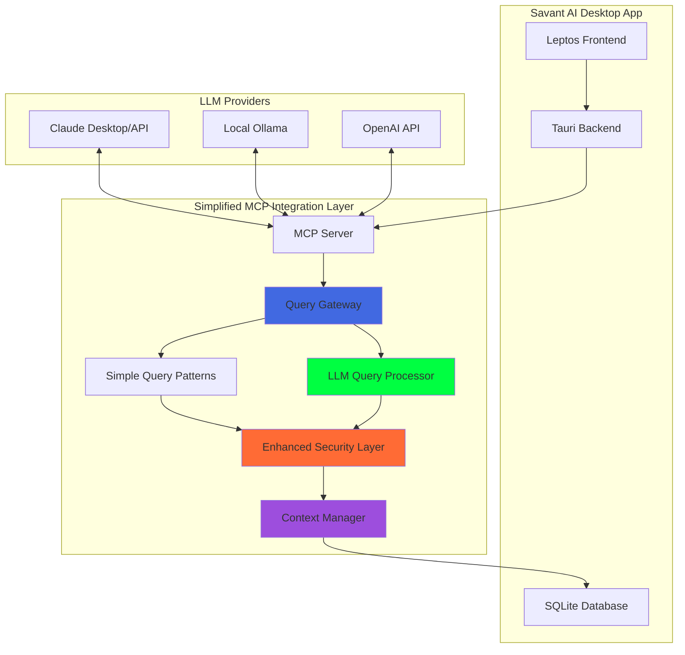

# LLM Database Integration Plan for Savant AI

## Executive Summary

This document outlines a comprehensive plan for making Savant AI's smart conversation database queryable using LLMs with natural language responses. The plan evaluates multiple integration approaches, with a focus on the Model Context Protocol (MCP) as the primary recommended solution, while providing fallback options and a phased implementation strategy.

## 1. Integration Approach Analysis

### A. Model Context Protocol (MCP) - **RECOMMENDED PRIMARY**

#### Overview
MCP is an open standard by Anthropic that standardizes AI-data source connections. It provides a universal interface using JSON-RPC 2.0 protocol with three-tier architecture: Hosts (LLM apps), Clients (connectors), and Servers (data sources).

#### Why MCP for Savant AI
- **Future-Proof**: Emerging standard with growing ecosystem support
- **Desktop Integration**: Perfect for Tauri apps with local SQLite databases
- **Security**: Built-in access control and validation mechanisms
- **Standardization**: Consistent interface across different LLM providers

#### Implementation Architecture (Revised)


#### Technical Specifications
- **Transport**: Abstracted transport layer (stdio primary, HTTP/WebSocket future)
- **Protocol**: JSON-RPC 2.0 with streaming support
- **Resources**: Database schema, conversation lists, speaker profiles
- **Tools**: Natural language query, analytics, semantic search, context-aware responses
- **Security**: Enhanced validation, rate limiting, timing attack prevention
- **Context**: Session-based conversation context management

### B. Direct Function Calling - **RECOMMENDED SECONDARY**

#### Overview
Implement structured function calling interface for common database operations. This provides immediate functionality while MCP infrastructure is being developed.

#### Implementation Strategy
```rust
// Tauri command structure for LLM function calling
#[tauri::command]
async fn llm_query_conversations(
    natural_query: String,
    filters: QueryFilters,
) -> Result<QueryResponse, String> {
    // 1. Parse natural language intent
    // 2. Map to structured database query
    // 3. Execute with security validation
    // 4. Format response for LLM consumption
}
```

### C. Hybrid RAG + Function Calling - **FUTURE ENHANCEMENT**

#### Overview
Combine retrieval-augmented generation for semantic search with function calling for structured operations.

#### Use Cases
- Semantic search across conversation content
- Context-aware query refinement
- Intelligent result ranking and filtering

## 2. Detailed Implementation Plan

### Phase 1: Foundation Layer (Weeks 1-2)

#### 1.1 Enhanced Database Schema
```sql
-- Natural language query metadata
CREATE TABLE query_history (
    id UUID PRIMARY KEY,
    natural_query TEXT NOT NULL,
    structured_query TEXT NOT NULL,
    execution_time_ms INTEGER,
    result_count INTEGER,
    user_feedback TEXT,
    timestamp TIMESTAMPTZ DEFAULT NOW()
);

-- Query intent classification
CREATE TABLE query_intents (
    id TEXT PRIMARY KEY,
    description TEXT,
    example_queries TEXT[], -- JSON array
    sql_template TEXT,
    required_parameters TEXT[] -- JSON array
);
```

#### 1.2 Security Layer Implementation
```rust
pub struct QuerySecurityManager {
    allowed_tables: HashSet<String>,
    max_result_limit: usize,
    query_timeout: Duration,
}

impl QuerySecurityManager {
    pub fn validate_query(&self, query: &str, complexity: QueryComplexity) -> Result<(), SecurityError> {
        // 1. Parse SQL to AST
        let ast = sqlparser::parse_sql(query).map_err(|_| SecurityError::InvalidSQL)?;
        
        // 2. Validate SELECT-only operations
        self.ensure_read_only(&ast)?;
        
        // 3. Check table whitelist
        self.validate_table_access(&ast)?;
        
        // 4. Validate result limits
        self.check_result_limits(&ast)?;
        
        // 5. Check for sensitive data access
        self.validate_column_access(&ast)?;
        
        // 6. Prevent timing-based attacks
        if self.contains_timing_attack_patterns(query) {
            return Err(SecurityError::TimingAttack);
        }
        
        // 7. Rate limiting per query complexity
        if !self.rate_limiter.check_complexity(complexity) {
            return Err(SecurityError::RateLimitExceeded);
        }
        
        // 8. Enforce parameterized queries
        if self.contains_string_concatenation(query) {
            return Err(SecurityError::RequiresParameterization);
        }
        
        Ok(())
    }
    
    pub fn sanitize_natural_query(&self, input: &str) -> String {
        // Remove potentially dangerous characters
        let sanitized = input.chars()
            .filter(|c| c.is_alphanumeric() || " .,?!-_()[]{}".contains(*c))
            .take(1000)  // Limit query length
            .collect();
        
        // Validate encoding and return
        String::from_utf8_lossy(sanitized.as_bytes()).to_string()
    }
    
    fn estimate_query_cost(&self, query: &str) -> QueryComplexity {
        // Analyze query complexity for rate limiting
        let complexity_score = query.matches("JOIN").count() * 2 +
                              query.matches("ORDER BY").count() * 1 +
                              query.matches("GROUP BY").count() * 2;
        
        match complexity_score {
            0..=2 => QueryComplexity::Low,
            3..=5 => QueryComplexity::Medium,
            _ => QueryComplexity::High,
        }
    }
}
```

#### 1.3 LLM-Powered Query Processor (Revised)
```rust
pub struct QueryProcessor {
    llm_client: Box<dyn LLMClient>,
    simple_patterns: Vec<(Regex, String)>,
    context_manager: Arc<ConversationContextManager>,
}

pub struct QueryResult {
    pub intent: IntentType,
    pub sql_query: String,
    pub parameters: HashMap<String, serde_json::Value>,
    pub confidence: f32,
}

#[derive(Debug)]
pub enum IntentType {
    FindConversations,
    AnalyzeSpeaker,
    SearchContent,
    GetStatistics,
    ExportData,
    Unknown,
}

impl QueryProcessor {
    pub async fn process_query(&self, natural_query: &str, session_id: &str) -> Result<QueryResult> {
        // First try simple pattern matching for common queries
        if let Some(simple_result) = self.try_simple_patterns(natural_query) {
            return Ok(simple_result);
        }
        
        // Enhance query with conversation context
        let enhanced_query = self.context_manager.enhance_query(session_id, natural_query);
        
        // Use LLM for complex query understanding
        let llm_response = self.llm_client.complete(&format!(
            "Convert this natural language query to a structured database query:
            Query: {}
            
            Return JSON with:
            - intent: find_conversations|analyze_speaker|search_content|get_statistics
            - sql_query: parameterized SQL query with ? placeholders
            - parameters: object with parameter values
            - confidence: 0.0-1.0
            
            JSON:", enhanced_query
        )).await?;
        
        serde_json::from_str(&llm_response).map_err(Into::into)
    }
}
```

### Phase 2: MCP Server Implementation (Weeks 3-4)

#### 2.1 MCP Server Architecture
```rust
// Cargo.toml additions
[dependencies]
serde = { version = "1.0", features = ["derive"] }
serde_json = "1.0"
tokio = { version = "1.0", features = ["full"] }
uuid = { version = "1.0", features = ["v4"] }

// MCP Resource definitions
#[derive(Serialize, Deserialize)]
pub struct ConversationResource {
    pub uri: String,
    pub name: String,
    pub description: String,
    pub mime_type: String,
}

// MCP Tool definitions
#[derive(Serialize, Deserialize)]
pub struct QueryTool {
    pub name: String,
    pub description: String,
    pub input_schema: serde_json::Value,
}
```

#### 2.2 MCP Communication Protocol
```rust
pub struct MCPServer {
    database: Arc<TranscriptDatabase>,
    security: QuerySecurityManager,
    query_parser: NaturalLanguageQueryParser,
}

impl MCPServer {
    pub async fn handle_request(&self, request: MCPRequest) -> MCPResponse {
        match request.method.as_str() {
            "resources/list" => self.list_resources().await,
            "resources/read" => self.read_resource(request.params).await,
            "tools/list" => self.list_tools().await,
            "tools/call" => self.call_tool(request.params).await,
            _ => MCPResponse::error("Unknown method"),
        }
    }
    
    async fn call_tool(&self, params: serde_json::Value) -> MCPResponse {
        let tool_name = params["name"].as_str().unwrap_or("");
        
        match tool_name {
            "query_conversations" => {
                let query = params["arguments"]["query"].as_str().unwrap_or("");
                self.execute_natural_query(query).await
            }
            "get_speaker_analytics" => {
                let speaker_id = params["arguments"]["speaker_id"].as_str().unwrap_or("");
                self.get_speaker_analytics(speaker_id).await
            }
            "search_semantic" => {
                let search_term = params["arguments"]["term"].as_str().unwrap_or("");
                self.semantic_search(search_term).await
            }
            _ => MCPResponse::error("Unknown tool"),
        }
    }
}
```

#### 2.3 Stdio Transport Implementation
```rust
pub struct StdioTransport {
    stdin: tokio::io::Stdin,
    stdout: tokio::io::Stdout,
}

impl StdioTransport {
    pub async fn start_server(&mut self, server: MCPServer) {
        let mut lines = self.stdin.lines();
        
        while let Some(line) = lines.next_line().await.unwrap() {
            if let Ok(request) = serde_json::from_str::<MCPRequest>(&line) {
                let response = server.handle_request(request).await;
                let response_json = serde_json::to_string(&response).unwrap();
                self.stdout.write_all(response_json.as_bytes()).await.unwrap();
                self.stdout.write_all(b"\n").await.unwrap();
                self.stdout.flush().await.unwrap();
            }
        }
    }
}
```

### Phase 3: Enhanced Query Intelligence (Weeks 5-6)

#### 3.1 Intent Classification System
```rust
pub struct IntentClassifier {
    patterns: HashMap<IntentType, Vec<Regex>>,
}

impl IntentClassifier {
    pub fn new() -> Self {
        let mut patterns = HashMap::new();
        
        // Find conversations patterns
        patterns.insert(IntentType::FindConversations, vec![
            Regex::new(r"(?i)find.*conversations?.*with").unwrap(),
            Regex::new(r"(?i)show.*talks?.*between").unwrap(),
            Regex::new(r"(?i)list.*meetings?.*involving").unwrap(),
        ]);
        
        // Speaker analysis patterns
        patterns.insert(IntentType::AnalyzeSpeaker, vec![
            Regex::new(r"(?i)analyze.*speaker").unwrap(),
            Regex::new(r"(?i)how.*much.*talked").unwrap(),
            Regex::new(r"(?i)statistics.*for").unwrap(),
        ]);
        
        // Content search patterns
        patterns.insert(IntentType::SearchContent, vec![
            Regex::new(r"(?i)search.*for").unwrap(),
            Regex::new(r"(?i)find.*mentions?.*of").unwrap(),
            Regex::new(r"(?i)conversations?.*about").unwrap(),
        ]);
        
        Self { patterns }
    }
    
    pub fn classify(&self, query: &str) -> QueryIntent {
        for (intent_type, regexes) in &self.patterns {
            for regex in regexes {
                if regex.is_match(query) {
                    return QueryIntent {
                        intent_type: *intent_type,
                        entities: self.extract_entities(query),
                        confidence: 0.8, // Simplified confidence scoring
                    };
                }
            }
        }
        
        // Default fallback
        QueryIntent {
            intent_type: IntentType::SearchContent,
            entities: HashMap::new(),
            confidence: 0.3,
        }
    }
}
```

#### 3.2 Entity Extraction
```rust
pub struct EntityExtractor {
    speaker_patterns: Regex,
    date_patterns: Regex,
    topic_patterns: Regex,
}

impl EntityExtractor {
    pub fn extract_entities(&self, query: &str) -> HashMap<String, String> {
        let mut entities = HashMap::new();
        
        // Extract speaker names
        if let Some(captures) = self.speaker_patterns.captures(query) {
            if let Some(speaker) = captures.get(1) {
                entities.insert("speaker".to_string(), speaker.as_str().to_string());
            }
        }
        
        // Extract date references
        if let Some(captures) = self.date_patterns.captures(query) {
            if let Some(date) = captures.get(1) {
                entities.insert("date".to_string(), date.as_str().to_string());
            }
        }
        
        // Extract topics
        if let Some(captures) = self.topic_patterns.captures(query) {
            if let Some(topic) = captures.get(1) {
                entities.insert("topic".to_string(), topic.as_str().to_string());
            }
        }
        
        entities
    }
}
```

#### 3.3 Dynamic Query Building
```rust
pub struct QueryBuilder {
    templates: HashMap<IntentType, String>,
}

impl QueryBuilder {
    pub fn build_query(&self, intent: &QueryIntent) -> Result<String, QueryError> {
        let template = self.templates.get(&intent.intent_type)
            .ok_or(QueryError::UnknownIntent)?;
        
        let mut query = template.clone();
        
        // Replace placeholders with extracted entities
        for (key, value) in &intent.entities {
            let placeholder = format!("{{{}}}", key);
            query = query.replace(&placeholder, value);
        }
        
        // Add default constraints
        if !query.contains("LIMIT") {
            query.push_str(" LIMIT 50");
        }
        
        Ok(query)
    }
}
```

### Phase 4: Advanced Features (Weeks 7-8)

#### 4.1 Semantic Search Integration
```rust
// Add to Cargo.toml
[dependencies]
candle-core = "0.6"
candle-transformers = "0.6"
candle-nn = "0.6"

pub struct SemanticSearchEngine {
    model: SentenceTransformer,
    embeddings_cache: HashMap<String, Vec<f32>>,
}

impl SemanticSearchEngine {
    pub async fn similarity_search(
        &self,
        query: &str,
        limit: usize,
    ) -> Result<Vec<SearchResult>, SearchError> {
        // 1. Generate query embedding
        let query_embedding = self.model.encode(query).await?;
        
        // 2. Search database for similar embeddings
        let sql = r#"
            SELECT s.*, c.title,
                   vector_distance(s.semantic_embedding, ?) as similarity
            FROM conversation_segments s
            JOIN conversations c ON s.conversation_id = c.id
            ORDER BY similarity ASC
            LIMIT ?
        "#;
        
        // 3. Execute similarity search
        // 4. Return ranked results
    }
}
```

#### 4.2 Context-Aware Response Generation
```rust
pub struct ResponseFormatter {
    templates: HashMap<IntentType, String>,
}

impl ResponseFormatter {
    pub fn format_response(
        &self,
        intent: &QueryIntent,
        results: &[QueryResult],
        natural_query: &str,
    ) -> String {
        match intent.intent_type {
            IntentType::FindConversations => {
                self.format_conversation_list(results, natural_query)
            }
            IntentType::AnalyzeSpeaker => {
                self.format_speaker_analysis(results, natural_query)
            }
            IntentType::SearchContent => {
                self.format_content_search(results, natural_query)
            }
            IntentType::GetStatistics => {
                self.format_statistics(results, natural_query)
            }
        }
    }
    
    fn format_conversation_list(&self, results: &[QueryResult], query: &str) -> String {
        format!(
            "Found {} conversations matching \"{}\"\n\n{}",
            results.len(),
            query,
            results.iter()
                .map(|r| format!("• {} - {} participants - {}", 
                    r.title, r.participant_count, r.timestamp))
                .collect::<Vec<_>>()
                .join("\n")
        )
    }
}
```

## 3. Integration with Existing Savant AI Architecture

### 3.1 Tauri Command Integration
```rust
// src-tauri/src/commands/llm_database.rs
#[tauri::command]
pub async fn natural_language_query(
    app: tauri::AppHandle,
    query: String,
) -> Result<QueryResponse, String> {
    let database = app.state::<Arc<TranscriptDatabase>>();
    let mcp_server = app.state::<Arc<MCPServer>>();
    
    // Process through MCP or direct depending on configuration
    mcp_server.execute_natural_query(&query).await
        .map_err(|e| e.to_string())
}

#[tauri::command]
pub async fn start_mcp_server(
    app: tauri::AppHandle,
) -> Result<String, String> {
    let mcp_server = app.state::<Arc<MCPServer>>();
    
    // Start MCP server on stdio
    tokio::spawn(async move {
        mcp_server.start_stdio_server().await;
    });
    
    Ok("MCP server started".to_string())
}
```

### 3.2 Frontend Integration
```typescript
// src/utils/llm_database.ts
import { invoke } from '@tauri-apps/api/core';

export interface QueryResponse {
    results: QueryResult[];
    summary: string;
    executionTime: number;
    natural_query: string;
    structured_query: string;
}

export async function queryDatabaseNaturally(query: string): Promise<QueryResponse> {
    try {
        const response = await invoke('natural_language_query', { query });
        return response as QueryResponse;
    } catch (error) {
        console.error('Natural language query failed:', error);
        throw error;
    }
}

export async function startMCPServer(): Promise<void> {
    try {
        await invoke('start_mcp_server');
        console.log('MCP server started successfully');
    } catch (error) {
        console.error('Failed to start MCP server:', error);
        throw error;
    }
}
```

### 3.3 UI Components
```rust
// src/components/natural_query.rs
use leptos::*;

#[component]
pub fn NaturalQueryInterface() -> impl IntoView {
    let (query, set_query) = create_signal(String::new());
    let (results, set_results) = create_signal(None::<QueryResponse>);
    let (loading, set_loading) = create_signal(false);
    
    let execute_query = create_action(|query: &String| {
        let query = query.clone();
        async move {
            crate::utils::llm_database::queryDatabaseNaturally(&query).await
        }
    });
    
    view! {
        <div class="natural-query-interface">
            <div class="query-input">
                <textarea
                    placeholder="Ask anything about your conversations..."
                    value=query
                    on:input=move |ev| set_query(event_target_value(&ev))
                />
                <button
                    on:click=move |_| execute_query.dispatch(query.get())
                    disabled=loading
                >
                    "Ask"
                </button>
            </div>
            
            {move || match results.get() {
                Some(response) => view! {
                    <div class="query-results">
                        <div class="summary">{response.summary}</div>
                        <div class="results">
                            {response.results.into_iter()
                                .map(|result| view! {
                                    <div class="result-item">
                                        <h4>{result.title}</h4>
                                        <p>{result.content}</p>
                                        <span class="metadata">
                                            {result.speaker} " - " {result.timestamp}
                                        </span>
                                    </div>
                                })
                                .collect::<Vec<_>>()
                            }
                        </div>
                    </div>
                },
                None => view! { <div class="no-results">"No results yet"</div> }
            }}
        </div>
    }
}
```

## 4. Deployment and Configuration

### 4.1 MCP Server Configuration
```toml
# ~/.config/savant-ai/mcp-config.toml
[server]
name = "savant-ai-database"
version = "1.0.0"
transport = "stdio"

[security]
read_only = true
max_results = 100
query_timeout_ms = 5000
allowed_tables = ["conversations", "conversation_segments", "speakers"]

[features]
semantic_search = true
analytics = true
export = false  # Disabled for security
```

### 4.2 LLM Provider Integration
```json
// Claude Desktop configuration
{
  "mcpServers": {
    "savant-ai": {
      "command": "/path/to/savant-ai/target/release/savant-mcp-server",
      "args": ["--config", "~/.config/savant-ai/mcp-config.toml"]
    }
  }
}
```

### 4.3 Ollama Integration
```rust
// Local Ollama integration for privacy-focused deployment
pub struct OllamaMCPBridge {
    ollama_client: OllamaClient,
    mcp_server: MCPServer,
}

impl OllamaMCPBridge {
    pub async fn process_natural_query(&self, query: &str) -> Result<String, Error> {
        // 1. Send query to local Ollama
        // 2. Parse function calls from Ollama response
        // 3. Execute via MCP server
        // 4. Format response for user
    }
}
```

## 5. Testing Strategy

### 5.1 Unit Tests
```rust
#[cfg(test)]
mod tests {
    use super::*;
    
    #[tokio::test]
    async fn test_intent_classification() {
        let classifier = IntentClassifier::new();
        
        let intent = classifier.classify("Find all conversations with John");
        assert_eq!(intent.intent_type, IntentType::FindConversations);
        assert!(intent.entities.contains_key("speaker"));
    }
    
    #[tokio::test]
    async fn test_query_security() {
        let security = QuerySecurityManager::new();
        
        // Should allow safe queries
        assert!(security.validate_query("SELECT * FROM conversations LIMIT 10").is_ok());
        
        // Should reject dangerous queries
        assert!(security.validate_query("DROP TABLE conversations").is_err());
    }
}
```

### 5.2 Integration Tests
```rust
#[tokio::test]
async fn test_end_to_end_query() {
    let db = setup_test_database().await;
    let mcp_server = MCPServer::new(db);
    
    let response = mcp_server.execute_natural_query(
        "Show me all conversations from last week with Sarah"
    ).await.unwrap();
    
    assert!(!response.results.is_empty());
    assert!(response.summary.contains("Sarah"));
}
```

## 6. Performance Considerations

### 6.1 Query Optimization
- **Indexed Lookups**: Ensure all common query patterns use database indexes
- **Result Caching**: Cache frequent query results with TTL
- **Connection Pooling**: Manage database connections efficiently
- **Async Processing**: Use non-blocking operations throughout

### 6.2 Memory Management
```rust
// Efficient memory usage for large result sets
pub struct StreamingQueryResults {
    cursor: Cursor<QueryResult>,
    batch_size: usize,
}

impl StreamingQueryResults {
    pub async fn next_batch(&mut self) -> Option<Vec<QueryResult>> {
        // Stream results in batches to avoid memory spikes
    }
}
```

### 6.3 Scalability Planning
- **Database Partitioning**: Time-based partitioning for conversation data
- **Index Maintenance**: Automated index optimization
- **Cache Invalidation**: Smart cache invalidation strategies
- **Resource Limits**: Configurable limits for queries and results

## 7. Security and Privacy

### 7.1 Access Control Matrix
| Operation | MCP Server | Direct CLI | Frontend |
|-----------|------------|------------|----------|
| Read Conversations | ✅ | ✅ | ✅ |
| Read Speaker Data | ✅ | ✅ | ✅ |
| Write Data | ❌ | ✅ | ❌ |
| Delete Data | ❌ | ✅ | ❌ |
| Export Data | ❌ | ✅ | ❌ |
| Analytics | ✅ | ✅ | ✅ |

### 7.2 Data Privacy
- **Local Processing**: All queries processed on-device
- **No Cloud Dependencies**: Optional cloud LLM integration only
- **Audit Logging**: Track all database access
- **Data Minimization**: Return only necessary data fields

### 7.3 Input Validation
```rust
pub fn validate_natural_query(query: &str) -> Result<(), ValidationError> {
    // Length limits
    if query.len() > 1000 {
        return Err(ValidationError::QueryTooLong);
    }
    
    // Character validation
    let allowed_chars = query.chars().all(|c| {
        c.is_alphanumeric() || " .,?!-_()[]{}".contains(c)
    });
    
    if !allowed_chars {
        return Err(ValidationError::InvalidCharacters);
    }
    
    // Content filtering (optional)
    if contains_sensitive_patterns(query) {
        return Err(ValidationError::SensitiveContent);
    }
    
    Ok(())
}
```

## 8. Documentation and Training

### 8.1 User Documentation
- **Quick Start Guide**: Getting started with natural language queries
- **Query Examples**: Common query patterns and expected results
- **Troubleshooting**: Common issues and solutions
- **Privacy Guide**: Understanding data handling and security

### 8.2 Developer Documentation
- **API Reference**: Complete MCP server API documentation
- **Integration Guide**: How to integrate with external LLM providers
- **Extension Points**: How to add new query capabilities
- **Performance Tuning**: Optimization strategies and best practices

## 9. Monitoring and Maintenance

### 9.1 Query Analytics
```rust
pub struct QueryAnalytics {
    query_counts: HashMap<String, u32>,
    execution_times: Vec<Duration>,
    error_rates: HashMap<String, f32>,
}

impl QueryAnalytics {
    pub fn record_query(&mut self, query: &str, execution_time: Duration, success: bool) {
        // Track query patterns and performance
    }
    
    pub fn generate_report(&self) -> AnalyticsReport {
        // Generate performance and usage reports
    }
}
```

### 9.2 Health Monitoring
- **Query Performance**: Track average execution times
- **Error Rates**: Monitor query failures and types
- **Resource Usage**: Memory and CPU utilization
- **Cache Hit Rates**: Effectiveness of caching strategies

## 10. Future Enhancements

### 10.1 Advanced AI Features
- **Query Refinement**: AI-powered query suggestion and refinement
- **Result Summarization**: Automatic summarization of large result sets
- **Trend Analysis**: AI-powered conversation trend detection
- **Anomaly Detection**: Identify unusual conversation patterns

### 10.2 Multi-Modal Integration
- **Voice Queries**: Speech-to-text query input
- **Visual Results**: Chart and graph generation for analytics
- **Export Formats**: Rich export formats (PDF, charts, presentations)

### 10.3 Collaboration Features
- **Shared Queries**: Save and share common query patterns
- **Query Templates**: Pre-built templates for common use cases
- **Collaborative Analytics**: Multi-user analytics and insights

## Implementation Timeline

| Phase | Duration | Key Deliverables |
|-------|----------|------------------|
| Phase 1 | 2 weeks | Enhanced database schema, security layer, basic NL parser |
| Phase 2 | 2 weeks | Full MCP server implementation with stdio transport |
| Phase 3 | 2 weeks | Advanced query intelligence and entity extraction |
| Phase 4 | 2 weeks | Semantic search, context-aware responses, UI integration |
| Testing | 1 week | Comprehensive testing and performance optimization |
| Documentation | 1 week | Complete documentation and user guides |

**Total Estimated Timeline: 10 weeks**

## Conclusion

This plan provides a comprehensive, phased approach to implementing natural language database querying for Savant AI. The MCP-based architecture ensures future compatibility while the hybrid approach with direct function calling provides immediate functionality. The emphasis on security, privacy, and performance aligns with Savant AI's desktop-focused, privacy-first approach while opening possibilities for future cloud integrations and advanced AI capabilities.

The implementation maintains the project's UNIX philosophy through modular, composable components while providing a seamless user experience for natural language database interactions.