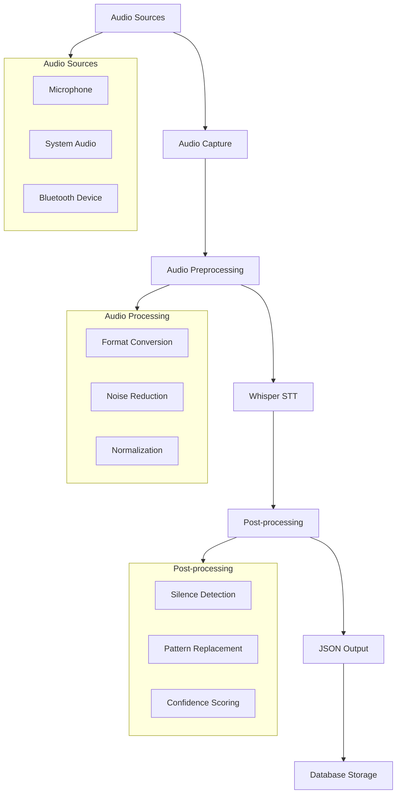

# Audio Transcription System

Comprehensive guide to Savant AI's real-time audio transcription capabilities with speaker separation and intelligent post-processing.

## Overview

The audio transcription system captures audio from multiple sources, processes it through Whisper models, and outputs structured JSON data suitable for database storage and analysis.

### Key Features

- **Multi-source Audio**: Microphone input and system audio capture
- **Speaker Separation**: Distinguish between user input and computer output
- **Post-processing Intelligence**: Handle silence, unclear audio, and repetitive patterns
- **Session Management**: Group related recordings with UUIDs
- **Structured Output**: JSON-first with optional markdown export
- **Language Control**: Force specific languages to prevent auto-detection issues

## Audio Pipeline Architecture



## Audio Capture

### Supported Sources

#### Microphone Input (Default)
```bash
# Basic microphone recording
savant-transcribe --duration 30

# With speaker identification
savant-transcribe --speaker "user" --duration 60

# Specific device selection
savant-transcribe --device "USB Microphone" --duration 30
```

#### System Audio Capture
```bash
# Capture computer output (calls, videos, etc.)
savant-transcribe --system --duration 1800

# System audio with speaker tagging
savant-transcribe --system --speaker "system" --duration 300

# Mixed sources (future feature)
savant-transcribe --mixed --speaker "call_participants" --duration 3600
```

### Audio Configuration

#### Sample Rates and Formats
- **Input**: 44.1kHz (typical), auto-detected
- **Processing**: 16kHz mono (Whisper requirement)
- **Conversion**: Automatic resampling and channel mixing

#### Quality Settings
```bash
# High quality (larger models)
savant-transcribe --model "models/ggml-large.bin" --language en

# Fast processing (smaller models)
savant-transcribe --model "models/ggml-tiny.en.bin" --language en

# Balanced (default)
savant-transcribe --model "models/ggml-base.en.bin" --language en
```

## Speech-to-Text Processing

### Whisper Integration

#### Model Selection
| Model | Size | Speed | Accuracy | Use Case |
|-------|------|-------|----------|----------|
| tiny.en | 39MB | Fastest | Basic | Real-time notes |
| base.en | 142MB | Fast | Good | General use |
| small.en | 244MB | Medium | Better | Important meetings |
| medium.en | 769MB | Slow | High | Transcription quality |
| large | 1550MB | Slowest | Best | Professional transcription |

#### Language Detection
```bash
# Force English (prevents "you" repetition issues)
savant-transcribe --language en

# Auto-detect (may cause issues with unclear audio)
savant-transcribe  # No language specified

# Other languages
savant-transcribe --language zh  # Chinese
savant-transcribe --language es  # Spanish
savant-transcribe --language fr  # French
```

### Processing Parameters

#### Whisper Configuration
```rust
// Internal configuration (from SttConfig)
pub struct SttConfig {
    pub model_path: String,
    pub language: Option<String>,        // Force language
    pub translate_to_english: bool,      // Auto-translate
    pub temperature: f32,                // Sampling randomness
    pub no_speech_threshold: f32,        // Silence detection
    pub enable_timestamps: bool,         // Word-level timing
    pub max_tokens: u32,                 // Output length limit
}
```

#### Default Settings
- **Temperature**: 0.0 (deterministic output)
- **No Speech Threshold**: 0.6 (silence detection sensitivity)
- **Timestamps**: Enabled (segment-level timing)
- **Word Timestamps**: Disabled (for performance)

## Post-Processing Intelligence

### Silence and Unclear Audio Handling

The system automatically detects and handles common speech-to-text issues:

#### Repetitive Pattern Detection
```rust
// Detects patterns like "you you you you"
fn remove_repetitive_you(text: &str) -> String {
    // Regex: 3+ consecutive "you" words → "[unclear audio]"
    let re = Regex::new(r"(?i)\b(you[\s,.]*)(\s*you[\s,.]*){2,}").unwrap();
    re.replace_all(text, "[unclear audio] ").to_string()
}
```

#### Isolated Filler Replacement
```rust
// Replaces standalone "you" in short segments
fn replace_isolated_you(text: &str) -> String {
    // Only in short text (≤3 words) → "[no signal]"
    if text.trim().split_whitespace().count() <= 3 {
        // Replace isolated "you" → "[no signal]"
    }
}
```

### Examples of Post-Processing

| Original Output | Post-Processed | Reason |
|----------------|----------------|---------|
| "you you you you" | "[unclear audio]" | Repetitive pattern |
| "you." | "[no signal]" | Isolated filler |
| "Hello, how are you?" | "Hello, how are you?" | Valid context preserved |
| "you, you, you." | "[unclear audio]" | Punctuated repetition |

## Speaker Separation

### Speaker Identification

#### Manual Speaker Tagging
```bash
# User speech (microphone)
savant-transcribe --speaker "user" --duration 30

# System output (computer audio)
savant-transcribe --system --speaker "system" --duration 30

# Named participants
savant-transcribe --speaker "john_doe" --duration 60
savant-transcribe --speaker "client_call" --system --duration 1800
```

#### Audio Source Types
```rust
pub enum AudioSource {
    Microphone,                    // User input
    SystemAudio,                   // Computer output
    BluetoothDevice(String),       // Named BT device
    Unknown,                       // Fallback
}
```

### Session Management

#### Session Grouping
```bash
# Manual session ID for related recordings
savant-transcribe --session-id "meeting-2025-07-01" --speaker "user"
savant-transcribe --session-id "meeting-2025-07-01" --speaker "presenter" --system

# Auto-generated UUIDs (default)
savant-transcribe --speaker "user"  # Creates new UUID per recording
```

#### Session Metadata
```json
{
  "session_metadata": {
    "session_id": "meeting-2025-07-01",
    "timestamp": "2025-07-01T14:30:00Z",
    "audio_source": "Microphone",
    "speaker": "user",
    "device_info": "savant-transcribe-0.1.0"
  }
}
```

## Output Formats

### JSON Structure (Primary)

```json
{
  "text": "Full transcript text with post-processing applied",
  "language": "en",
  "segments": [
    {
      "text": "Individual segment text",
      "start_time": 0.0,
      "end_time": 3.2,
      "confidence": 0.95,
      "words": null
    }
  ],
  "processing_time_ms": 1250,
  "model_used": "models/ggml-base.en.bin",
  "session_metadata": {
    "session_id": "uuid-or-custom",
    "timestamp": "2025-07-01T14:30:00Z",
    "audio_source": "Microphone",
    "speaker": "user",
    "device_info": "savant-transcribe-0.1.0"
  }
}
```

### Markdown Export (Legacy)

```bash
# Generate markdown format
savant-transcribe --format markdown --output transcript.md

# Markdown includes:
# - Header with metadata
# - Full transcript
# - Timestamped segments
# - Processing details
```

## Performance Optimization

### Model Selection Strategy

#### Real-time Use Cases
```bash
# Fast response for live notes
savant-transcribe --model "models/ggml-tiny.en.bin" --duration 10
```

#### High Accuracy Needs
```bash
# Best quality for important recordings
savant-transcribe --model "models/ggml-large.bin" --language en --duration 3600
```

#### Balanced Approach (Recommended)
```bash
# Good speed/quality balance
savant-transcribe --model "models/ggml-base.en.bin" --language en
```

### Processing Optimization

#### Batch Processing
```bash
# Process multiple files efficiently
find recordings/ -name "*.wav" | \
xargs -P 4 -I {} savant-transcribe --input {} --format json
```

#### Memory Management
- **Audio Buffers**: Processed in chunks to manage memory
- **Model Loading**: Models cached in memory between sessions
- **Streaming**: Large files processed in segments

### Hardware Considerations

#### CPU vs GPU
```bash
# CPU-only (default)
savant-transcribe --duration 30

# GPU acceleration (if available)
cargo build --features cuda  # NVIDIA
cargo build --features metal # Apple Silicon
```

#### Memory Requirements
- **tiny.en**: ~1GB RAM
- **base.en**: ~2GB RAM  
- **large**: ~4GB RAM
- **System Audio**: Additional 500MB buffer

## Troubleshooting

### Common Issues

#### Audio Device Problems
```bash
# List available devices
savant-transcribe --list-devices

# Permission issues (macOS)
# Grant microphone access in System Preferences > Security & Privacy
```

#### Model Loading Issues
```bash
# Download models to correct location
mkdir -p models/
wget https://huggingface.co/ggerganov/whisper.cpp/resolve/main/ggml-base.en.bin -O models/ggml-base.en.bin
```

#### "You" Repetition Issues
```bash
# Force English to prevent auto-detection
savant-transcribe --language en --duration 30

# Use larger models for better accuracy
savant-transcribe --model "models/ggml-small.en.bin" --language en
```

### Debug Output

```bash
# Enable verbose logging
RUST_LOG=debug savant-transcribe --duration 10

# Test audio capture only
RUST_LOG=info savant-transcribe --duration 5 --format markdown
```

### Performance Monitoring

```bash
# Monitor processing time
savant-transcribe --duration 30 | jq '.processing_time_ms'

# Check model accuracy
savant-transcribe --duration 30 | jq '.segments[].confidence'
```

## Background Daemon

### Automated Audio Capture

The system includes a background daemon for continuous audio monitoring:

```bash
# Start background daemon
./sav start

# Check daemon status
./sav status

# View live logs
./sav logs

# Search captured content
./sav search "meeting"

# Stop daemon
./sav stop
```

### Single-Instance Protection

The daemon uses PID-based locking to prevent multiple instances:

- **Automatic Detection**: Checks for existing daemon before starting
- **Graceful Handling**: Shows clear error messages for conflicts
- **Crash Recovery**: Automatically cleans up stale PID files
- **Testing Interface**: Built-in test command to verify protection

```bash
# Test protection mechanism
./sav test
```

### Daemon Configuration

Default settings in `scripts/audio/savant-audio-daemon.sh`:
- **Segment Duration**: 300 seconds (5 minutes)
- **Audio Device**: BlackHole 2ch (system audio)
- **Output Format**: Markdown with JSON metadata
- **Storage Location**: `~/Documents/savant-ai/data/audio-captures/`

## Integration Examples

### Database Pipeline
```bash
# Direct transcription to database
savant-transcribe --speaker "user" --duration 60 | \
savant-db store --title "Voice Note $(date)"
```

### External Processing
```bash
# Send to external APIs
savant-transcribe --duration 30 | \
curl -X POST -H "Content-Type: application/json" \
     -d @- https://api.sentiment-analysis.com/analyze
```

### Continuous Monitoring
```bash
# Background daemon handles continuous recording
./sav start

# Monitor activity
./sav logs

# Search recent captures
./sav search "project update"
```